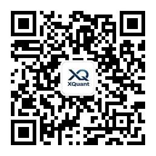

# open-xquant

open-xquant 是面向 AI Coding Agent 和人类量化研究者的 **Agentic Quant Research Kernel**。

> 本框架源于 [xquant.shop](https://xquant.shop) 量化研究平台的实践沉淀。

它把交易想法转化为可声明、可复现、可审计、可沉淀的研究产物：

```
idea → idea audit → spec → user confirmation → backtest → report → final
```

open-xquant 不是一个 Coding Agent，而是 Coding Agent 应该调用的确定性量化研究内核。
CLI / SDK 只负责可复现的底层执行；报告撰写、图表选择、实验对比和
spec 来源追溯这类需要综合判断的任务，交给已安装的 Agent skills 驱动。

它的目标不是更快生成更多策略，而是更快识别和拒绝假的回测结果。

→ **[Human Guide](docs/human-guide.md)**（用 Agent 使用 open-xquant）
→ **[Agent Guide](docs/agent-guide.md)**（给 AI Agent 看的安装指南）

[English](#english) | [中文](#为什么需要-open-xquant)

---

## 为什么需要 open-xquant？

### 传统量化框架的困境

现有的量化回测框架（如 Backtrader、vnpy、Zipline 等）是为**程序员**设计的。它们假设使用者能精确编写每一行代码，能手动管理状态与数据流，能在复杂的 API 文档中找到正确的调用方式。

这在过去没有问题——因为人就是唯一的编程主体。

### AI 时代的新矛盾

大语言模型（LLM）正在重塑软件开发方式。越来越多的人开始通过 AI 编程来构建量化策略。但这带来了一个根本性矛盾：

**AI 擅长理解意图、生成代码——但它会产生幻觉。**

当前主流 AI 基于 Transformer 架构，其生成过程本质上是概率性的。同一个提示词，两次生成的代码可能存在细微差异。这种不确定性在大多数软件领域可以接受，但在金融交易中是致命的：

> **不可重复 = 不可信 = 不可交易**

一个回测结果如果无法精确复现，那它就没有任何决策价值。

### 问题的根源

问题不在于 AI 不够聪明，而在于**现有框架从未考虑过 AI 作为使用者**。当 AI 被迫使用为人类设计的框架时：

- **过多的自由度** → AI 每次可能选择不同的实现路径
- **隐式的约定** → AI 无法可靠地遵守文档中未明确表述的规则
- **状态管理的复杂性** → AI 容易在多步操作中引入不一致

## open-xquant 的解法

open-xquant 采用 **Agentic Quant Research Kernel** 的设计哲学——它是一个给 AI Agent 使用的确定性量化研究内核，提供声明式策略规格、确定性回测、偏差审计、稳健性测试和研究报告产物标准。

### 1. 声明式优先

用户（或 AI）描述**"做什么"**，框架负责**"怎么做"**。策略通过 `strategy_spec.yaml` 声明，减少实现路径的分歧，从源头降低不确定性。

### 2. 确定性执行保证

相同 spec + 相同数据 = 相同回测结果，无例外。框架层面强制保证可重复性，不依赖使用者（无论是人还是 AI）的自律。

### 3. 约束即安全

通过 spec validation、research bias audit、robustness tests 三道防线，收窄 AI 的选择空间。当错误的做法会被自动检测时，幻觉就无处可存。

### 4. 结构化研究产物

每次研究都留下固定结构的 artifacts——metrics、trades、target weights、
equity curve、artifact hashes、audit、report——可版本化、可 diff、可沉淀。

## 核心流程

以下 `<phase_paths.*>` 从活动版本的 `version_manifest.json` 解析。若
`.open-xquant/workspace.yaml` 省略 `paths.versions_dir`，则 `version_root`
默认使用 `versions`。

```
Agent loads open-xquant skill
  → manage-strategy-version opens or continues a strategy version
  → brainstorm-strategy-idea writes strategy_idea_brief.json
  → audit-strategy-idea checks the brainstorm process and user evidence
  → build-strategy-spec writes <phase_paths.04_spec_build>/strategy_spec.yaml
  → audit-strategy-spec checks provenance and prints the full SPEC table
  → user confirms the full SPEC table
  → audit-runtime-semantics compiles and checks compiled_plan.json semantics
  → oxq runtime-audit validate <phase_paths.08_runtime_audit>/runtime_audit.json
  → run-authorized-backtest runs gated backtest
  → oxq audit reproducibility <phase_paths.09_backtests>/<run_id>/
  → oxq audit research <phase_paths.09_backtests>/<run_id>/
  → oxq robustness run <phase_paths.09_backtests>/<run_id>/
  → build-report-charts registers the default professional chart pack
  → write-research-report writes research_report.md/html
  → oxq report qa <phase_paths.10_reports>/<run_id>/
  → review-research-report reviews the final report
  → oxq experiment add <phase_paths.09_backtests>/<run_id>/
  → compare-strategy-versions and select-final-version govern final choice
```

这里的 `oxq` CLI 步骤是确定性 primitives：验证、编译、回测、审计、
稳健性、报告文件与资产完整性 QA，以及实验登记。报告数值叙事是否合理、
图表是否足以支撑结论、是否接受某个 run 为最终版本，都需要由 skill
结合上下文判断。

策略研究目录按 `strategy family -> strategy version -> run attempt` 治理。
完整目录结构、角色协作和有向图见
[Strategy Workflow Artifact Governance](docs/strategy-workflow-artifact-governance.md)。

## 本地认证外部算子

open-xquant 可以人工认证一个本地 Git 仓库中已经构建好的算子 wheel：

```bash
oxq operator certify-provider \
  --provider-repo ../equant-py \
  --provider-commit <40位小写提交SHA> \
  --trust-provider-code
```

`--provider-commit` 是包含 catalog、manifest、baseline 和 build record 的
提交，不是实现源码提交。build record 中的 `source_commit` 指向更早的实现
源码提交，并且该提交必须是 submission commit 的祖先。固定入口是
`compat/open_xquant/operator_catalog.json`；catalog 引用的 build record、
manifest 和 baseline 路径都相对 `compat/open_xquant/`。默认从
`<provider-repo>/dist` 读取已构建 wheel；可用 `--artifact-dir` 覆盖。
命令只在当前环境中验证 provider，成功时报告 `research-certified` 状态，
不会在仓库中发布认证结果目录。

当前命令只接受已存在的本地 Git 目录和完整的 40 位小写 SHA；不接受 GitHub
URL。certifier 自身不会 clone、fetch、download、install 或 build，也不会主动
从网络取件。执行过程会运行 provider wheel，因此必须显式提供
`--trust-provider-code`。隔离子进程用于限制导入污染、失败和超时，不是针对
恶意代码的操作系统或网络安全沙箱；受信 provider code 仍可访问本机文件和网络。

成功状态 `research-certified` 只允许研究和离线分析。策略运行或实盘接入仍然
要求 `runtime-certified` 且算子的因果性为 `past_only`。provider 文件布局、
产物和完整边界见
[operator certification contract](contracts/operator-certification/README.md)。

## 谁适合使用 open-xquant？

- **AI 时代的量化学习者**：通过声明式 spec 学习量化投资，无需成为资深程序员
- **量化策略研究者**：专注于策略逻辑本身，框架负责验证、审计、报告
- **AI 应用开发者**：构建基于 LLM 的自动化量化研究 Agent

## 入门书稿

如果你还没有量化交易基础，建议先阅读：

[人人都是量化交易员：XQuant Beginner 量化交易入门](https://github.com/xingwudao/xquant-beginner)

这本开源书面向量化交易入门和自学读者，先用 AI 与 Python 跑通
数据获取、策略回测、风险评估和因子研究，再逐步过渡到 open-xquant。

## 通过示例学习

`examples/` 目录提供了由浅入深的学习路径。

### Tushare Pro A 股日线

安装可选依赖并通过环境变量配置 token：

```bash
uv sync --extra tushare
export TUSHARE_TOKEN="your-token"
```

```python
from oxq.data import TushareDownloader

downloader = TushareDownloader()  # 首次使用时读取 TUSHARE_TOKEN
path = downloader.download("600519.SH", "2024-01-01", "2024-12-31")

# 显式构造参数 token 的优先级高于环境变量。
explicit = TushareDownloader(token="your-token")
```

首版仅支持 A 股日线，证券代码必须完全匹配
`^[0-9]{6}\.(SH|SZ|BJ)$`：六位数字加大写交易所后缀，例如
`600519.SH`。`end` 日期包含在下载范围内。输出价格默认为前复权（qfq），
计算公式为
`raw_price * row_adj_factor / reference_adj_factor`；参考因子取包含端点的
`end` 当日或之前的最新有效复权因子，它可以独立于最后一条日线交易记录。
`volume` 的单位为股。Tushare 账户权限、积分和限流由 Tushare 平台决定。
Tushare `daily` 单次最多返回 6000 行。下载器会把长区间自动切成每块最多
3650 个包含端点的日历日，`daily` 与 `adj_factor` 使用完全相同、无重叠且
无缺口的边界；短区间仍只请求一次。任一分块响应达到 6000 行时会在写入前
失败，避免静默接受可能被截断的数据；成功 manifest 仍记录用户请求的完整
`start` 和 `end`。
下载得到的标准 Parquet 仍通过 `data.provider: local` 用于研究和回测，不能
把 provider 设置为 `tushare`。

open-xquant 不会持久化 token，也不会把它写入日志、异常或输出产物。
凭据的网络传输由上游 Tushare SDK 控制；其当前官方客户端使用 HTTP。
用户应自行评估这一上游传输边界，并遵守 Tushare 的服务条款和安全要求。

### 推荐学习顺序

**第一步：模块示例（`examples/modules/`）**

可执行的 Python 脚本，逐个演示核心模块的 SDK 和等价 CLI 用法：

| 文件 | 内容 |
|------|------|
| `01_spec_and_validate.py` | Spec 创建与 P0 校验 |
| `02_data_and_universe.py` | 数据下载、读取、Universe 构建 |
| `03_backtest_and_artifacts.py` | Spec 编译、回测执行、artifact 读取 |
| `04_audit_and_robustness.py` | 可复现审计、偏差审计、稳健性测试 |
| `05_report_and_experiment.py` | 报告 artifact、QA 与实验登记 |
| `06_signals_and_rules.py` | Signal、Rule、ROCTiming 与 BUY/SELL/HOLD 语义 |
| `11_tdx_data_and_universe.py` | 可选 PyTdx/TdxQuant 下载、读取与 Universe 构建 |

```bash
uv run python examples/modules/01_spec_and_validate.py
uv run python examples/modules/11_tdx_data_and_universe.py --help
```

**第二步：Spec 校验（`examples/strategies/spec_validation_demo.py`）**

展示 validator 对 5 种 spec 的判断（pass / fail / warn）：

```bash
uv run python examples/strategies/spec_validation_demo.py
```

**第三步：策略示例（`examples/strategies/`）**

完整的端到端策略管线示例（spec → backtest → audit → report）：

| 文件 | 策略类型 |
|------|----------|
| `sma_crossover_spec.py` | SMA 均线交叉 — 完整 E2E 管线 |
| `momentum_rotation_spec.py` | 动量轮动 — 完整 E2E 管线 |
| `roc_timing_spec.py` | ROC 择时 — fixed threshold 与 rolling quantile spec |
| `factor_screen.py` | 多因子筛选示例 |

## 项目边界

open-xquant 是完整可用的开源研究内核，聚焦确定性计算、
声明式 spec、审计、artifact QA 和 Agent 可调用的 CLI / SDK / Tools。
需要语义判断的策略描述收集、报告、图表、实验对比和最终版本选择由
Agent skills 编排。

不属于 open-xquant 核心边界的能力：

- 托管式云端状态机。
- 多用户协作和计费。
- 私有研究记忆图谱。
- 私有 Eval Corpus。
- 托管式 PIT 数据服务。

原则：**开源版必须能独立完成可复现的量化研究闭环。**

## 项目状态

open-xquant 正在从 Agent First 量化交易框架升级为 Agentic Quant Research Kernel。

已完成：
- 核心引擎 (Engine, Strategy, types, registry)
- 30+ 指标库、8 种信号、9 种规则、6 种组合优化器
- 因子评估 (IC, ICIR, decay, turnover, tearsheet)
- 参数优化 (grid search, walk-forward, cross-validation)
- 可观测性 (tracing, audit, monitoring, experiment log)
- Strategy Spec (schema, validator, compiler)
- Audit System (reproducibility + research bias)
- Runtime execution assumptions (calendar, fill price, lot size, cash return)
- Metrics profiles (`open_xquant_default`, `xquant_production`)
- Robustness Runner (cost stress, IS/OOS diff, parameter perturbation, regimes)
- Report asset manifest and deterministic report QA
- Agent skills for strategy brainstorming, idea audit, spec build, spec audit,
  report writing, chart building, experiment comparison, and final selection
- Workspace-local custom component manifests and deterministic extension
  loading
- Version-governed research workspace layout, lineage audit, and mapping
  contract validation
- Multi-Agent role presets for Codex, OpenCode, Claude Code, and Cursor,
  including component authoring
- OpenCode 集成

## 作者与服务

### 刑无刀

本文作者 @刑无刀。《机器学习：实用案例解析》译者，《推荐系统》
作者，极客时间《推荐系统 36 式》专栏作者，开源书《人人都是
量化交易员》作者，15 年 AI 从业经验，贝壳（纽交所 + 港交所
双重上市公司，股票代码 BEKE/2423）前技术总监。

- 公众号：刑无刀
- 小红书：刑无刀


### MatrixSpk

本文作者 @MatrixSpk，多年财务及投资经验，系北大 MBA，
公众号「i锐角」主理人。

- 公众号：i锐角


### XQuant-Shop

XQuant-Shop 是面向全球个人投资者的一站式量化投资决策平台，
简称 XQuant 平台。XQuant 平台集成标准化量化数据可视化看板、
零门槛策略搭建工具与自动化工作流体系，帮助普通投资者快速搭建
专属量化投资策略。

- 服务号：XQuant-Shop



## License

[MIT](LICENSE)

---

<a id="english"></a>

# open-xquant

open-xquant is an **Agentic Quant Research Kernel** for AI coding agents and human quant researchers.

> This framework emerged from building the [xquant.shop](https://xquant.shop) quant research platform.

It turns trading ideas into declarative, reproducible, auditable, and persistent research artifacts:

```
idea → idea audit → spec → user confirmation → backtest → report → final
```

open-xquant is not a coding agent. It is the deterministic quant research runtime that coding agents should use.
The CLI / SDK provide reproducible execution primitives; tasks that require
contextual judgment, such as report writing, chart selection, experiment
comparison, and spec provenance review, are driven by installed Agent skills.

Its goal is not to generate more strategies faster, but to make false backtests easier to detect and reject.

→ **[Human Guide](docs/human-guide.md)** (use open-xquant through an Agent)
→ **[Agent Guide](docs/agent-guide.md)** (installation guide for AI agents)

---

## Why open-xquant?

### The Problem with Traditional Quant Frameworks

Existing backtesting frameworks (Backtrader, vnpy, Zipline, etc.) are designed for **programmers**. They assume users can write every line of code precisely, manage state and data flow manually, and navigate complex API documentation.

This was fine in the past — humans were the only ones writing code.

### A New Contradiction in the AI Era

LLMs are reshaping software development. More people are building quant strategies through AI programming. But this introduces a fundamental contradiction:

**AI is great at understanding intent and generating code — but it hallucinates.**

Current mainstream AI generation is inherently probabilistic. The same prompt can produce subtly different code on two runs. This uncertainty is acceptable in most software domains, but in financial trading it's fatal:

> **Not reproducible = not trustworthy = not tradable**

### Root Cause

The problem isn't that AI isn't smart enough — it's that **existing frameworks were never designed with AI as a user**. When AI is forced to use frameworks built for humans:

- **Too many degrees of freedom** → AI may choose different implementation paths each time
- **Implicit conventions** → AI cannot reliably follow rules not explicitly stated
- **Complex state management** → AI easily introduces inconsistencies across multi-step operations

## The open-xquant Approach

open-xquant is an **Agentic Quant Research Kernel** — a deterministic runtime that provides declarative strategy specs, deterministic backtests, bias audits, robustness tests, and research report standards.

### 1. Declarative First

Users (or AI) describe **"what to do"**; the framework handles **"how to do it"**. Strategies are declared via `strategy_spec.yaml`, reducing divergent implementation paths at the source.

### 2. Deterministic Execution Guarantee

Same spec + same data = same backtest result, no exceptions. Reproducibility is enforced at the framework level.

### 3. Constraints as Safety

Three defense lines — spec validation, research bias audit, and robustness tests — narrow AI's choice space. When wrong approaches are automatically detected, hallucination has nowhere to go.

### 4. Structured Research Artifacts

Every research run produces fixed-structure artifacts — metrics, trades,
target weights, equity curve, artifact hashes, audit, report — versionable,
diffable, and persistent.

## Core Workflow

The `<phase_paths.*>` placeholders below resolve from the active version's
`version_manifest.json`. When `.open-xquant/workspace.yaml` omits
`paths.versions_dir`, `version_root` defaults to `versions`.

```
Agent loads the open-xquant skill
  → manage-strategy-version opens or continues a strategy version
  → brainstorm-strategy-idea writes strategy_idea_brief.json
  → audit-strategy-idea checks the brainstorm process and user evidence
  → build-strategy-spec writes <phase_paths.04_spec_build>/strategy_spec.yaml
  → audit-strategy-spec checks provenance and prints the full SPEC table
  → user confirms the full SPEC table
  → audit-runtime-semantics compiles and checks compiled_plan.json semantics
  → oxq runtime-audit validate <phase_paths.08_runtime_audit>/runtime_audit.json
  → run-authorized-backtest runs gated backtest
  → oxq audit reproducibility <phase_paths.09_backtests>/<run_id>/
  → oxq audit research <phase_paths.09_backtests>/<run_id>/
  → oxq robustness run <phase_paths.09_backtests>/<run_id>/
  → build-report-charts registers the default professional chart pack
  → write-research-report writes research_report.md/html
  → oxq report qa <phase_paths.10_reports>/<run_id>/
  → review-research-report reviews the final report
  → oxq experiment add <phase_paths.09_backtests>/<run_id>/
  → compare-strategy-versions and select-final-version govern final choice
```

The `oxq` CLI steps are deterministic primitives: validation, compilation,
backtesting, audits, robustness, report file and asset-integrity QA, and
experiment registration. Skills handle contextual judgment, including whether
numeric narratives are justified, whether charts support the conclusion, and
whether a run should be accepted as final.

Research workspaces are governed as `strategy family -> strategy version ->
run attempt`. See
[Strategy Workflow Artifact Governance](docs/strategy-workflow-artifact-governance.md)
for the directory layout, role handoffs, and workflow graph.

## Certifying External Operators Locally

open-xquant can manually certify prebuilt operator wheels from a local Git
repository:

```bash
oxq operator certify-provider \
  --provider-repo ../equant-py \
  --provider-commit <full-40-character-lowercase-sha> \
  --trust-provider-code
```

`--provider-commit` selects the later submission commit containing the catalog,
manifests, baselines, and build record. The build record's `source_commit`
selects the earlier implementation commit and must be its ancestor. The fixed
entry point is `compat/open_xquant/operator_catalog.json`; catalog build-record,
manifest, and baseline paths are relative to `compat/open_xquant/`. Wheels are
read from `<provider-repo>/dist` by default; use `--artifact-dir` to override
that default. The command verifies the provider in the current environment and
reports `research-certified` on success; it does not publish a certification
result directory into the repository.

This command accepts only an existing local Git directory and a full lowercase
40-character SHA. It does not accept a GitHub URL. Certifier-owned code does
not clone, fetch, download, install, build, or proactively retrieve artifacts
from the network. Provider wheels execute during certification, so
`--trust-provider-code` is mandatory. The child process isolates imports,
failures, and timeouts; it is neither an operating-system nor a network
security sandbox. Trusted provider code can still access local files and the
network.

`research-certified` permits research and offline analysis only. Strategy or
live execution still requires `runtime-certified` together with `past_only`.
See the
[operator certification contract](contracts/operator-certification/README.md)
for the provider layout and complete boundary.

## Who Is This For?

- **Quant learners in the AI era**: Learn quant investing through declarative specs
- **Quant strategy researchers**: Focus on strategy logic; the framework handles validation, audit, and reporting
- **AI application developers**: Build LLM-powered automated quant research agents

## Learn by Examples

### Tushare Pro A-share Daily Data

Install the optional dependency and configure the token through the
environment:

```bash
uv sync --extra tushare
export TUSHARE_TOKEN="your-token"
```

```python
from oxq.data import TushareDownloader

downloader = TushareDownloader()  # reads TUSHARE_TOKEN on first use
path = downloader.download("600519.SH", "2024-01-01", "2024-12-31")

# Explicit constructor token takes precedence over the environment.
explicit = TushareDownloader(token="your-token")
```

The first release supports A-share daily data only. Symbols must match
`^[0-9]{6}\.(SH|SZ|BJ)$` exactly: six digits followed by an uppercase exchange
suffix, for example `600519.SH`. The `end` date is inclusive. Output prices use
forward adjustment (qfq), calculated as
`raw_price * row_adj_factor / reference_adj_factor`; the reference factor is
the latest valid adjustment factor on or before the inclusive `end` and may be
independent of the last daily trading row. `volume` is in shares. Tushare
account permissions, points, and rate limits are determined by the Tushare
platform. Tushare `daily` returns at most 6,000 rows per call. The downloader
automatically splits long ranges into inclusive chunks of at most 3,650
calendar days; `daily` and `adj_factor` use identical, gap-free,
non-overlapping boundaries, while short ranges still use one call. A chunk
that reaches 6,000 rows is rejected before output is written, because it may
have been truncated. A successful manifest still records the user's complete
original `start` and `end` range. Research and backtests continue to consume
the downloaded standard Parquet through `data.provider: local`; do not set
the provider to `tushare`.

open-xquant does not persist the token or write it to logs, exceptions, or
output artifacts. Credential transport is controlled by the upstream Tushare
SDK, whose current official client uses HTTP. Users should assess this upstream
transport boundary and follow Tushare's terms of service and security
requirements.

### Step 1: Module Examples (`examples/modules/`)

Runnable Python scripts demonstrating each core module with SDK and equivalent CLI:

| File | Content |
|------|---------|
| `01_spec_and_validate.py` | Spec creation & P0 validation |
| `02_data_and_universe.py` | Data download, inspect, universe construction |
| `03_backtest_and_artifacts.py` | Spec compile, backtest run, artifact inspection |
| `04_audit_and_robustness.py` | Reproducibility audit, bias audit, robustness tests |
| `05_report_and_experiment.py` | Report artifacts, QA, and experiment registry |
| `06_signals_and_rules.py` | Signals, rules, ROCTiming, and BUY/SELL/HOLD semantics |
| `11_tdx_data_and_universe.py` | Selectable PyTdx/TdxQuant download, readback, and Universe construction |

```bash
uv run python examples/modules/01_spec_and_validate.py
uv run python examples/modules/11_tdx_data_and_universe.py --help
```

### Step 2: Spec Validation (`examples/strategies/spec_validation_demo.py`)

Demonstrates 5 validator outcomes (pass / fail / warn):

```bash
uv run python examples/strategies/spec_validation_demo.py
```

### Step 3: Strategy Examples (`examples/strategies/`)

Complete E2E pipeline examples (spec → backtest → audit → report):

| File | Strategy Type |
|------|---------------|
| `sma_crossover_spec.py` | SMA Crossover — complete E2E pipeline |
| `momentum_rotation_spec.py` | Momentum Rotation — complete E2E pipeline |
| `roc_timing_spec.py` | ROC Timing — fixed threshold and rolling quantile specs |
| `factor_screen.py` | Multi-factor screening example |

## Project Boundaries

open-xquant is a complete open-source research kernel focused on deterministic
computation, declarative specs, audits, artifact QA, and Agent-callable
CLI / SDK / Tools. Strategy idea collection, semantic report writing, chart
selection, experiment comparison, and final version selection are orchestrated
by Agent skills.

Capabilities outside the core open-xquant boundary:

- Hosted cloud state machines.
- Multi-user collaboration and billing.
- Private research memory graphs.
- Private eval corpora.
- Hosted PIT data services.

Principle: **The open-source package must independently complete a
reproducible quant research loop.**

## Project Status

open-xquant is upgrading from an Agent First trading framework to an Agentic Quant Research Kernel.

Completed:
- Core engine (Engine, Strategy, types, registry)
- 30+ indicators, 8 signals, 9 rules, 6 portfolio optimizers
- Factor evaluation (IC, ICIR, decay, turnover, tearsheet)
- Parameter optimization (grid search, walk-forward, cross-validation)
- Observability (tracing, audit, monitoring, experiment log)
- Strategy Spec (schema, validator, compiler)
- Audit System (reproducibility + research bias)
- Runtime execution assumptions (calendar, fill price, lot size, cash return)
- Metrics profiles (`open_xquant_default`, `xquant_production`)
- Robustness Runner (cost stress, IS/OOS diff, parameter perturbation, regimes)
- Report asset manifest and deterministic report QA
- Agent skills for strategy brainstorming, idea audit, spec build, spec audit,
  report writing, chart building, experiment comparison, and final selection
- Workspace-local custom component manifests and deterministic extension
  loading
- Version-governed research workspace layout, lineage audit, and mapping
  contract validation
- Multi-Agent role presets for Codex, OpenCode, Claude Code, and Cursor,
  including component authoring
- OpenCode integration

## License

[MIT](LICENSE)
