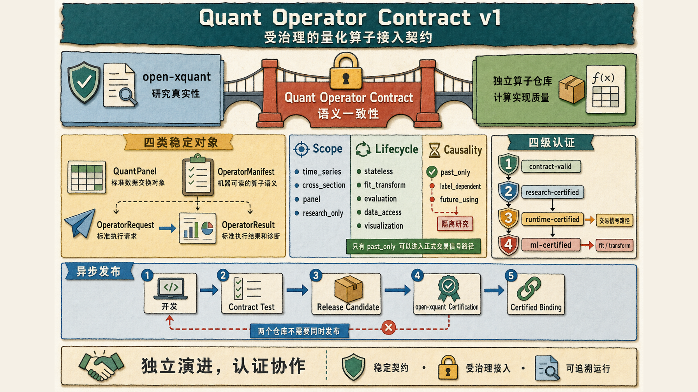
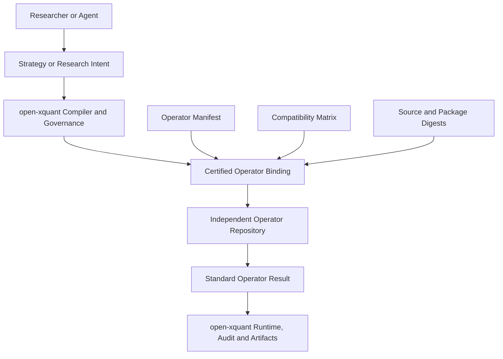

# Quant Operator Contract v1 设计规范

状态：已冻结（Frozen）
契约版本：1.0.0
冻结日期：2026-08-26

>
> 适用对象：向 open-xquant 提供指标、因子、数据处理、研究评价、
> 机器学习特征或其他量化计算能力的独立算子仓库。
>
> 首个目标实现：equant-py。



## 1. 文档目的

本规范定义 open-xquant 与外部量化计算层之间的稳定契约。

它不要求外部项目采用 open-xquant 的 Strategy Spec、Engine、Agent 工作流
或研究目录。外部项目可以继续保持独立仓库、独立 API、独立发布节奏和
独立用户群体。

只有被声明为“open-xquant Compatible”的算子，才必须满足本规范。

本规范解决以下问题：

- 如何让 open-xquant 安全地复用外部量化算法。
- 如何避免函数签名、列名和隐式约定泄漏到研究内核。
- 如何区分时间序列、横截面、面板和离线研究计算。
- 如何在编译期识别未来数据、训练标签和拟合状态。
- 如何固定算子版本、实现摘要和依赖环境。
- 如何让 Agent 通过结构化目录理解能力，而不是猜测 API。
- 如何让两个独立仓库以异步发布方式长期协作。

## 2. 定位

open-xquant 不建设任意插件平台，也不追求支持所有计算框架。

Quant Operator Contract 的定位是：

> 为经过认证的高价值量化计算能力提供一条受治理的接入路径。

open-xquant 负责研究真实性：

- 策略语义。
- 因果执行。
- 交易时点。
- 数据和组件版本。
- 回测、审计、稳健性和实验比较。
- 模型训练边界和推理时点。
- Agent 权限、确认和产物治理。

算子提供方负责计算实现质量：

- 数学公式和算法实现。
- 输入输出契约。
- 数值精度。
- 性能和资源消耗。
- 算子单元测试。
- 发布、兼容和弃用策略。

本契约负责二者之间的语义一致性。

## 3. 规范语言

本文使用以下约束词：

- `MUST`：不满足即不能通过兼容认证。
- `MUST NOT`：出现即不能通过兼容认证。
- `SHOULD`：原则上必须满足，例外需要在 manifest 中解释。
- `MAY`：可选能力。

JSON Schema 是本契约的结构层，只验证可由 Draft 2020-12 表达的对象形状、
字段类型和条件分支。`reference_validator_v1.py` 是不可绕过的语义层，验证
跨字段集合、QuantPanel 记录、参数约束与摘要输入。一个对象只有依次通过
对应 JSON Schema 和 reference validator，才是本契约意义上的合法对象。
OperatorBinding 在通过 `operator-binding-v1.schema.json` 后，还 `MUST` 调用
发布的 `validate_operator_binding()`，把重复 identity/provenance 字段与真实
manifest、provider source、正式 implementation artifact 和四项 contract
surface 文件逐 byte 绑定；只通过 binding JSON Schema 不能启用 binding。
`manifest_path` 指向的准确文件 bytes 是 manifest 的权威工件；这些 bytes
`MUST` 作为严格 UTF-8 JSON 解码，解码后的对象 `MUST` 与接受 JSON Schema
和语义验证的 manifest 对象按 JSON 类型递归相同。一次 binding 验证 `MUST`
只读取该路径一次，并用同一份内存 byte 快照完成解码、对象比较和 manifest
digest 计算；不能分别验证一个对象并散列另一个文件或文件快照。

## 4. 非目标

本规范不要求算子仓库：

- 导入 open-xquant Python 包。
- 使用 open-xquant 的 Protocol 类型。
- 使用 open-xquant 的 Engine。
- 删除自己的回测框架或交互式 API。
- 把所有公开函数都暴露给 open-xquant。
- 与 open-xquant 同步发版。
- 为 open-xquant 冻结整个公开 API。
- 承担研究工作流和最终决策责任。

本规范也不允许 open-xquant：

- 通过任意字符串导入未认证函数。
- 静默切换算子实现。
- 把研究评价函数当成交易信号函数。
- 把外部回测引擎的结果直接当成正式研究证据。

## 5. 总体架构



算子仓库不接管 open-xquant 的工作流。

open-xquant 也不复制算子仓库的所有内部模块。

两者通过以下四类稳定对象协作：

- `QuantPanel`：标准数据交换对象。
- `OperatorManifest`：机器可读的算子语义。
- `OperatorRequest`：标准执行请求。
- `OperatorResult`：标准执行结果和诊断。

## 6. 发布与包管理要求

### 6.1 唯一 distribution name

每个可集成子包 `MUST` 使用唯一、可解析的 distribution name。

Python import name 可以与 distribution name 不同。

例如：

```text
distribution: equant-ttr
import: ettr
```

算子提供方 `MUST NOT` 依赖已经被其他项目占用的 distribution name。

### 6.2 正式发布物

兼容版本 `MUST` 提供：

- sdist。
- 目标 Python 版本可安装的 wheel。
- 完整依赖元数据。
- 许可证和源码地址。
- 变更日志。
- 发布 tag 和不可变源码提交。

open-xquant `MUST NOT` 以开发者本地路径或 editable install
作为正式集成方式。

### 6.3 版本策略

兼容包 `MUST` 使用语义化版本。

以下变化 `MUST` 提升 major version：

- 改变数学公式。
- 改变默认参数并导致输出变化。
- 改变输出字段。
- 改变 NaN 或 warmup 语义。
- 改变时间或横截面作用域。
- 改变因果性分类。
- 删除参数或算子。

以下变化可以提升 minor version：

- 新增算子。
- 新增不影响旧行为的参数。
- 新增可选输出。
- 性能优化且结果在声明容差内一致。

patch version `MUST NOT` 改变有效计算语义。

本节管理 provider 的 operator/package 语义版本。公式、默认值或输出变化
按照本节提升 provider major version 并重新认证，`MUST NOT` 因此自动提升
Quant Operator Contract major version。Contract/schema 自身的兼容方向由
`compatibility-policy-v1.md` 定义。

### 6.4 运行环境声明

每个发布版本 `MUST` 准确声明：

- Python 最低和最高支持版本。
- pandas、numpy 兼容范围。
- 操作系统支持范围。
- 原生库和系统依赖。
- 可选依赖的功能边界。

声明的最低版本 `MUST` 在 CI 中真实运行。

## 7. QuantPanel 数据契约

### 7.1 逻辑模型

`QuantPanel` 是逻辑契约，不强制某个具体 Python 类。

v1 默认使用长格式 `pandas.DataFrame`，一行代表一个资产在一个观测时点
或交易会话的记录。

必需标识字段：

- `date`
- `code`

常用行情字段：

- `open`
- `high`
- `low`
- `close`
- `volume`
- `adjusted`

算子可以要求其他字段，但必须在 manifest 中声明。

`columns[].name` `MUST` 唯一；每条记录 `MUST` 包含所有声明为 required 的
列，`MUST NOT` 包含未声明字段。required 列的键存在性与其值是否缺失是两个
不同条件：键缺失始终违法，键存在但值使用第 7.6 节定义的缺失表示则合法。
每个非缺失声明列的值 `MUST` 符合其 dtype。这些跨字段规则由
`reference_validator_v1.py` 执行。

### 7.2 主键

`(date, code)` `MUST` 唯一。

发现重复主键时，算子 `MUST` 报错，不能：

- 取第一条。
- 取最后一条。
- 自动聚合。
- 静默去重。

### 7.3 排序

算子 `MUST` 声明是否要求排序。

manifest 的 `input.requires_sorted_input` `MUST` 显式存在。值为 `true` 时，
`required_sort_order` `MUST` 是非空、无重复的列名序列，数组顺序定义排序
优先级且每列使用升序。每个排序键 `MUST` 是 `date`、`code` 或
`input.required_columns` 中声明的必需输入列；未知列和仅在
`input.optional_columns` 中出现的列不能构成可执行排序要求。值为 `false` 时
`MUST NOT` 携带该字段。

兼容算子 `SHOULD` 接受无序输入，并按稳定规则处理：

```text
date ASC, code ASC
```

输出对齐规则必须在 manifest 中声明为以下之一：

- `preserve_input_order`
- `canonical_order`
- `explicit_keyed_output`

### 7.4 时间语义

数据上下文 `MUST` 包含：

- `timezone`
- `calendar`
- `frequency`
- `timestamp_semantics`

`timestamp_semantics` 允许：

- `session_date`
- `bar_open`
- `bar_close`
- `event_time`
- `publication_time`

算子 `MUST NOT` 擅自删除时区或将本地时间解释为 UTC。

对于只使用交易日的日线面板，`date` 可以是无时区的会话日期，
但 `timezone` 和 `calendar` 仍然必须存在于显式上下文中。

### 7.5 市场上下文

数据上下文 `MUST` 能表达：

- `currency`
- `price_adjustment`
- `frequency`
- `calendar`
- `timezone`
- `data_version`
- `source`

`price_adjustment` 至少支持：

- `raw`
- `forward_adjusted`
- `backward_adjusted`
- `total_return_adjusted`

原始价格和复权价格 `MUST NOT` 在未声明时混用。

### 7.6 缺失值

JSON `null` 是 QuantPanel 交换对象的规范缺失值表示。Python adapter `MAY`
在交给 JSON 序列化边界前把浮点 NaN 或可无歧义识别的 pandas missing sentinel
作为输入便利表示；它们在可移植产物中 `MUST` 归一化为 JSON `null`。
正无穷和负无穷都不是缺失值，且对所有声明 dtype 都 `MUST` 判为非法。
reference validator 仅把精确 builtin `float` NaN 和明确的 pandas
`NAType`/`NaTType` 当作 adapter missing，`MUST NOT` 为 missing 检测对任意对象
执行隐式数值转换；可转换对象和超大整数仍 `MUST` 进入 dtype 校验并稳定报错。

required 列的键 `MUST` 出现在每条记录中。该键对应 `null` 或 adapter missing
sentinel 不等同于键缺失；`reference_validator_v1.py` 先检查键存在，再跳过缺失
值的 dtype 检查。

算子 `MUST` 声明缺失值策略：

- `propagate`
- `skip_window`
- `require_complete`
- `explicit_fill`

`explicit_fill` 需要同时声明填充值或填充方法。

算子 `MUST NOT` 静默前向填充行情字段。

### 7.7 输入不可变性

兼容算子 `MUST NOT` 修改调用者传入的 DataFrame。

如果实现为了性能支持原地修改，必须提供独立的非原地兼容入口，
并由 manifest 将 `mutates_input` 声明为 `false`。

## 8. OperatorManifest 契约

### 8.1 必需身份字段

每个算子 manifest `MUST` 包含：

```yaml
schema_version: 1
operator_id: vendor.package.operator
operator_version: 1.0.0
semantic_name: SMA
distribution: vendor-package
module: vendor_module
callable: function_name
```

`operator_id` 在一个 major contract version 内 `MUST` 稳定。

### 8.2 执行范围

`execution_scope` `MUST` 是以下值之一：

- `time_series`
- `cross_section`
- `panel`
- `research_only`

含义如下：

- `time_series`：每个资产只依赖自身当前及历史记录。
- `cross_section`：同一时点需要多个资产共同计算。
- `panel`：同时依赖时间和横截面结构。
- `research_only`：只用于离线研究、标签或评价。

### 8.3 生命周期

`lifecycle` `MUST` 是以下值之一：

- `stateless`
- `fit_transform`
- `evaluation`
- `data_access`
- `visualization`

`fit_transform` 算子必须提供可序列化拟合状态。

### 8.4 因果性

`causality` `MUST` 是以下值之一：

- `past_only`
- `label_dependent`
- `future_using`

只有 `past_only` 可以进入正式交易信号路径。

`label_dependent` 可以进入：

- 模型训练。
- 因子评价。
- 参数选择的训练阶段。

`future_using` 只能用于明确隔离的离线研究。

### 8.5 可用时点

算子 `MUST` 声明输出何时可用：

- `pre_open_t`
- `open_t`
- `intraday_t`
- `close_t`
- `after_close_t`
- `publication_time`

如果输出时点取决于输入字段，manifest `MUST` 提供确定性推导规则。

### 8.6 输入声明

manifest `MUST` 声明：

- 必需字段。
- 可选字段。
- 支持的数据类型。
- 最小资产数量。
- 最小时间长度。
- 是否要求完整横截面。
- 是否要求基准序列。
- 是否要求行业、市值或基本面数据。
- 是否要求排序，以及要求时的稳定升序列优先级。

必需字段与可选字段列表各自 `MUST` 无重复，且两个集合 `MUST` 互不相交。

### 8.7 参数声明

每个参数 `MUST` 声明：

- 类型。
- 默认值。
- 是否必填。
- 合法范围或枚举。
- 单位。
- 是否影响 warmup。
- 是否影响输出字段。
- 是否影响因果性或可用时点。

未知参数 `MUST` 报错。

参数 constraint 只能用于相符的参数类型；上下界、长度界和 item-count 界
`MUST` 自洽。默认值和每次请求值 `MUST` 同时满足声明类型以及 enum、range、
pattern、length 和 item-count 约束。`validate_operator_request_parameters()`
是标准请求参数语义检查入口，并 `MUST` 拒绝未知参数和缺少的 required 参数。

### 8.8 输出声明

manifest `MUST` 声明：

- 输出字段模板。
- dtype。
- 值域。
- 对齐规则。
- warmup 规则。
- NaN 规则。
- 是否存在多输出。

动态输出列名必须可以仅根据 manifest 和参数确定。

### 8.9 实现摘要

manifest 的 `implementation` `MUST` 包含：

- package version。
- 完整 source commit，格式仅允许 `git-sha1:<40 lowercase hex>` 或
  `git-sha256:<64 lowercase hex>`。
- 非空、唯一、相对 POSIX 且不包含 `..` 的 `source_files`。
- source tree digest。
- implementation digest。
- build identifier。

manifest digest `MUST NOT` 位于 manifest 自身。外部 binding/certification
record `MUST` 固定完整 contract surface release，以及 QuantPanel schema、
OperatorManifest schema、OperatorBinding schema 和 `reference_validator_v1.py`
各自的 release 与准确文件摘要，并记录 manifest 文件准确 UTF-8 字节的
SHA-256。source-tree 和正式 wheel 摘要的唯一算法定义见
`hash-profile-v1.md`。

启用前，`validate_operator_binding()` `MUST` 先执行 manifest semantic validator，
再验证 binding 与 manifest identity、provider source tree、manifest exact bytes、
正式 wheel exact bytes、legacy schema pin 和四项 contract surface pin。任何重复
字段不一致都 `MUST` 报错，不能静默选择其中一个来源。

## 9. OperatorRequest 与 OperatorResult

### 9.1 OperatorRequest

标准请求逻辑上包含：

```yaml
operator_id: vendor.package.operator
parameters: {}
input_panel: QuantPanel
context:
  timezone: Asia/Shanghai
  calendar: XSHG
  frequency: 1d
  currency: CNY
  price_adjustment: forward_adjusted
  evaluation_time: close_t
```

调用者不应把实现模块名散落在业务代码中。

### 9.2 OperatorResult

标准结果逻辑上包含：

```yaml
data: QuantPanel or keyed output
diagnostics:
  input_rows: 0
  output_rows: 0
  warmup_rows: 0
  dropped_rows: 0
  warnings: []
provenance:
  operator_id: vendor.package.operator
  operator_version: 1.0.0
  implementation_digest: sha256:aaaaaaaaaaaaaaaaaaaaaaaaaaaaaaaaaaaaaaaaaaaaaaaaaaaaaaaaaaaaaaaa
```

输出 `MUST` 包含足够信息，使 open-xquant 可以验证：

- 行数和主键。
- 输出字段。
- warmup。
- 缺失值。
- 实现版本。
- 诊断和失败范围。

## 10. 无状态和拟合型算子

### 10.1 无状态算子

无状态算子只由输入和参数决定结果。

典型例子：

- SMA。
- RSI。
- ATR。
- 固定窗口动量。

无状态算子 `MUST` 满足纯函数语义。

### 10.2 拟合型算子

以下能力通常属于拟合型算子：

- PCA 因子合成。
- IC 或 ICIR 加权。
- 行业和市值回归中性化。
- 因子筛选器。
- 机器学习模型。
- 需要估计分布参数的标准化。

拟合型算子 `MUST` 明确分离：

```text
fit(training_data) -> fitted_state
transform(data, fitted_state) -> result
```

`fit_transform(full_sample)` 可以作为交互式便利 API，
但 `MUST NOT` 被标记为正式回测兼容入口。

### 10.3 FittedState

拟合状态 `MUST` 可序列化，并记录：

- 算子身份和版本。
- 训练起止时间。
- 训练数据摘要。
- 输入特征顺序。
- 参数。
- 学习到的统计量或模型参数。
- 随机种子。
- 依赖版本。
- 状态 digest。

transform `MUST NOT` 隐式重新拟合。

## 11. 数据访问算子

数据访问与数值计算必须分离。

数据访问实现 `MUST`：

- 不直接向 stdout 打印进度。
- 不捕获通用异常后静默继续。
- 返回每个标的的完成状态。
- 声明数据源、请求参数和数据版本。
- 声明时区、日历、币种和复权方式。
- 支持严格完整性模式。
- 提供可取消的超时和重试策略。

标准结果应能表达：

```yaml
requested_symbols: []
completed_symbols: []
failed_symbols: {}
is_complete: true
data_manifest: {}
```

正式研究默认要求 `is_complete: true`。

## 12. 错误与诊断

兼容实现 `MUST` 使用结构化错误类别：

- `InvalidPanelError`
- `MissingColumnError`
- `DuplicateKeyError`
- `InvalidParameterError`
- `InsufficientHistoryError`
- `InsufficientCrossSectionError`
- `CausalityViolationError`
- `DependencyUnavailableError`
- `DataFetchError`
- `NumericalComputationError`

错误 `MUST` 包含：

- operator id。
- 稳定错误码。
- 人类可读信息。
- 相关字段或参数。
- 是否可重试。

兼容入口 `MUST NOT`：

- 通过 `print()` 报告错误。
- 返回部分结果但不标记缺失。
- 将错误转换为空 DataFrame。
- 自动更换数据源或算法。

## 13. 确定性与可复现

正式兼容算子必须满足：

```text
相同输入字节
+ 相同参数
+ 相同实现版本
+ 相同执行配置
= 相同输出或声明容差内的输出
```

算子 `MUST NOT` 隐式依赖：

- 当前时间。
- 网络状态。
- 未记录环境变量。
- 用户主目录配置。
- 全局随机状态。
- 输入行的偶然顺序。

随机算子 `MUST` 接受显式随机种子。`random_seed_required: true` 时，
`seed_parameter` `MUST` 指向 `parameters` 中存在的 integer 参数；为 `false`
时 `MUST NOT` 声明 `seed_parameter`。

并行、numba、BLAS 或 GPU 实现 `MUST` 声明：

- 是否逐位确定。
- 允许的绝对和相对误差。
- 已测试平台。

绝对和相对误差 `MUST` 是有限且非负的数值。

## 14. 性能要求

### 14.1 面板批量执行

面板算子 `MUST` 提供多资产批量入口。

open-xquant 不应为每个 symbol 重复完成：

- DataFrame 转换。
- 模块导入。
- 参数解析。
- 算子初始化。

### 14.2 基准场景

提供方 `SHOULD` 对以下规模建立基准：

- 100 symbols x 5 years daily。
- 500 symbols x 10 years daily。
- 5000 symbols x 5 years daily。

基准 `SHOULD` 记录：

- 墙钟时间。
- CPU 时间。
- 峰值内存。
- 输入复制次数。
- 输出行数。
- 批量与逐资产结果差异。

### 14.3 性能回归

同一 major version 中，典型基准性能下降超过 20% 时，
发布说明 `MUST` 解释原因。

## 15. 安全与依赖隔离

算子执行 `MUST NOT`：

- 执行任意用户代码。
- 根据 manifest 字符串导入任意未认证模块。
- 写入工作区之外的文件。
- 访问网络，除非生命周期为 `data_access`。
- 修改进程级环境变量。
- 修改全局 pandas 或 numpy 配置。

可选原生依赖 `MUST` 保持隔离。

例如，K 线形态依赖 TA-Lib 时：

- 核心指标安装不得强制安装 TA-Lib。
- 缺失 TA-Lib 时不得影响其他算子导入。
- 相关算子必须返回明确依赖错误。

## 16. Agent 语义元数据

每个被认证算子 `SHOULD` 提供：

- 中文名称。
- 英文名称。
- 数学公式。
- 类别。
- 参数解释。
- 输出解释。
- 推荐场景。
- 常见误用。
- 典型参数范围。
- 适用市场。
- 对换手率的潜在影响。
- 对交易成本的敏感性。
- 是否适合作为 ML 特征。
- 是否需要 PIT 数据。
- 多重检验风险提示。

Agent `MUST` 能通过 catalog 查询这些信息，
不应依赖读取整个源码仓库。

## 17. 机器学习元数据

可以作为特征的算子 `SHOULD` 声明：

```yaml
ml:
  usable_as_feature: true
  feature_availability: close_t
  requires_fit: false
  normalization_required: false
  expected_stationarity: weak
```

拟合型算子 `MUST` 声明：

```yaml
ml:
  usable_as_feature: true
  requires_fit: true
  fit_scope: training_window_only
  state_serializable: true
```

标签生成器 `MUST` 声明：

```yaml
ml:
  usable_as_label: true
  usable_as_feature: false
```

## 18. 测试和认证

### 18.1 提供方单元测试

每个算子 `MUST` 覆盖：

- 正常计算。
- 参数边界。
- 缺失列。
- warmup。
- NaN。
- 单资产。
- 多资产。
- 空输入。

### 18.2 契约测试

提供方 contract test `MUST` 先执行发布的 JSON Schema 结构层，再执行
`reference_validator_v1.py` 语义层；任何一层失败都不能声明 contract-valid。
binding fixture 还 `MUST` 在 binding JSON Schema 之后调用发布的
`validate_operator_binding()`；schema-valid 本身不是 binding-valid。

兼容目录 `MUST` 覆盖：

- 输入无序。
- 重复主键。
- 输入不可变。
- 输出对齐。
- 时区和日历上下文。
- 批量与逐资产一致性。
- 因果性声明。
- manifest 与实际签名一致。
- 依赖缺失隔离。
- Python 和 pandas 版本矩阵。

### 18.3 数值基线

关键算子 `MUST` 提供不可变 golden fixtures。

每个 fixture `MUST` 记录：

- 输入数据。
- 参数。
- 期望输出。
- 容差。
- 生成版本。
- 数据摘要。

### 18.4 open-xquant 认证

open-xquant certification `MUST` 对收到的 QuantPanel 与 OperatorManifest
执行同一 JSON Schema 结构层和 reference validator 语义层，不得用一层
替代另一层。对每个待启用 binding，还 `MUST` 使用认证输入的真实路径调用
`validate_operator_binding()`，不得仅信任 binding JSON 中已有的摘要字符串，
也不得向 Schema/语义层提供与该路径严格解码结果不同的 manifest 对象。

open-xquant 的认证额外检查：

- Strategy Spec 映射是否稳定。
- compiled plan 是否完整记录算子绑定。
- runtime 是否遵守作用域和因果性。
- run artifacts 是否固定版本和摘要。
- 研究审计是否能识别标签和未来数据。
- 性能是否满足正式股票池规模。

## 19. 兼容矩阵

算子仓库每次发布 `MUST` 提供类似以下声明：

```yaml
release: vendor-package-1.2.0
contract_version: 1

python:
  minimum: "3.12"
  maximum_exclusive: "3.14"

pandas:
  minimum: "2.2"
  maximum_exclusive: "3.0"

tested_open_xquant:
  minimum: "0.2.0"
  maximum_exclusive: "0.3.0"
```

open-xquant 维护独立认证状态：

```yaml
operator_release: vendor-package-1.2.0
contract: pass
numerical_regression: pass
causality: pass
performance: pass
certified: true
```

“提供方测试通过”和“open-xquant 认证通过”是两个不同结论。

## 20. 跨仓库产物

### 20.1 open-xquant 仓库

规范性文件建议位于：

```text
contracts/quant-operators/
  operator-contract-v1.md
  operator-manifest-v1.schema.json
  quant-panel-v1.schema.json
  operator-binding-v1.schema.json
  reference_validator_v1.py
  hash-profile-v1.md
  compatibility-policy-v1.md
```

### 20.2 算子仓库

兼容实现建议位于：

```text
compat/open_xquant/
  compatibility.yaml
  operator_catalog.json
  numerical_baselines/
  tests/
```

算子仓库不需要运行时依赖 open-xquant。

其 CI `MUST` 使用 binding 固定的三个 JSON Schema 和 reference validator
两层验证 catalog、binding 与 conformance fixtures。JSON Schema 是结构层，
`reference_validator_v1.py` 是不可绕过的语义层；enabled binding `MUST` 额外
调用发布的 `validate_operator_binding()` 复算所有 provenance 摘要。

## 21. 异步发布流程


发布顺序如下：

1. 算子仓库开发并发布 release candidate。
2. 提供方完成单元测试，并在 contract test 中执行 Schema 与语义 validator。
3. open-xquant 对指定版本执行包含同样两层验证的认证。
4. 认证通过后更新兼容矩阵。
5. open-xquant 在后续版本中启用绑定。

两个仓库不需要同时发布。

## 22. 认证等级

### 22.1 `contract-valid`

表示：

- manifest 合法。
- 数据契约合法。
- API 和依赖可安装。
- 基础契约测试通过。

不表示可以进入正式回测。

### 22.2 `research-certified`

额外表示：

- 数值基线通过。
- 因果性分类可信。
- 可以进入因子研究或离线分析。

### 22.3 `runtime-certified`

额外表示：

- `past_only` 证明通过。
- 执行时点明确。
- 批量执行和对齐通过。
- 性能满足正式回测要求。

只有该等级可以进入交易信号路径。

### 22.4 `ml-certified`

额外表示：

- fit/transform 分离。
- 训练边界可验证。
- fitted state 可序列化。
- 推理不会隐式拟合。

## 23. 新算子接入检查清单

接入一个新算子时必须回答：

- 它解决什么研究问题？
- 它属于哪个 execution scope？
- 它是否只使用历史数据？
- 输出何时可用？
- 它是否需要拟合？
- warmup 是多少？
- 必需输入字段是什么？
- 最小横截面和时间长度是多少？
- 如何处理 NaN、停牌和缺失资产？
- 输出如何与输入对齐？
- 是否修改输入？
- 依赖是否可选和隔离？
- 数值基线是什么？
- 性能基准是什么？
- Agent 应如何理解和避免误用？
- 哪个 package version 和 source digest 实现了它？

任何一项无法回答，都不能进入正式认证。

## 24. 对 equant-py 的首轮适配建议

equant-py 作为首个目标实现，应优先完成：

1. 解决 distribution name 和正式发布问题。
2. 修正 Python、pandas、numpy 的真实兼容声明。
3. 将 TA-Lib 等可选依赖从核心导入路径隔离。
4. 发布统一 operator catalog。
5. 为 `date`、`code`、时区和排序建立 QuantPanel 契约。
6. 给全部函数标记 execution scope 和 causality。
7. 将未来收益和 IC 类函数标记为 `research_only`。
8. 将 PCA、IC 加权和中性化改造成 fit/transform 模式。
9. 将数据下载中的 print 和静默跳过改成结构化结果。
10. 建立跨包 golden fixtures 和兼容矩阵。
11. 为 equant-ttr 建立真实 numba 安装和性能 CI。
12. 将脚本式 smoke test 转成正式 pytest 契约测试。

## 25. 最终原则

Quant Operator Contract 的价值不在于让 open-xquant 支持更多插件。

它的价值在于确保每个被采用的量化能力都满足：

- Agent 可理解。
- 编译器可验证。
- 引擎可高效执行。
- 研究人员可解释。
- 实验可精确复现。
- 升级影响可被发现。
- 未来数据和训练泄漏可被阻止。

只有满足这些条件的算法资产，才值得进入一个追求真实收益的量化研究系统。
