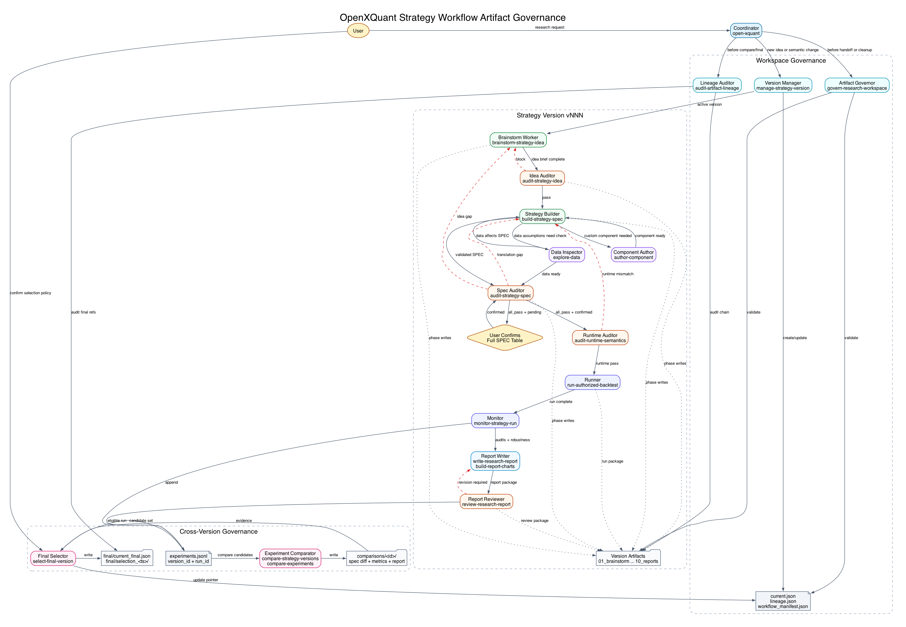
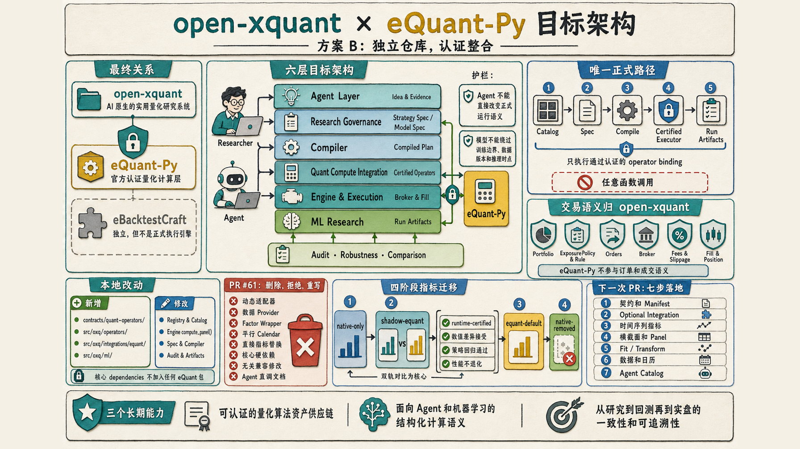
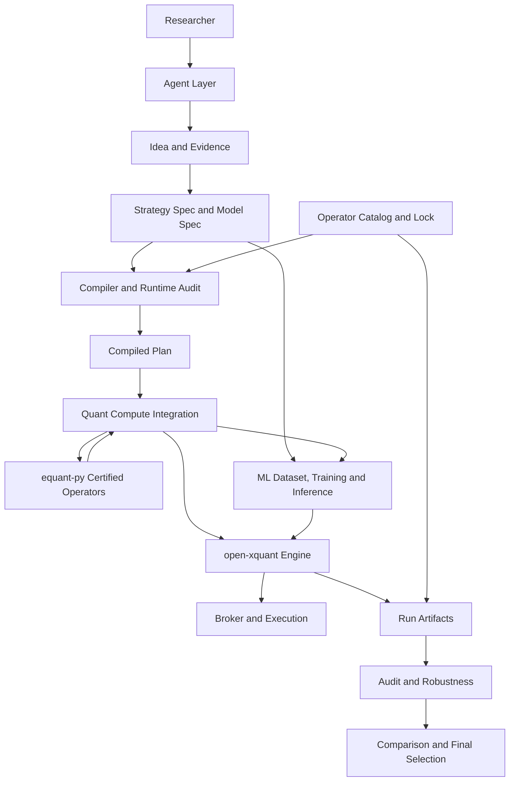

# open-xquant 架构文档

## 1. 设计哲学

open-xquant 是一个 **Agentic Quant Research Kernel**——面向 AI Coding Agent 和人类量化研究者的确定性量化研究内核。

**一句话定位**：

```text
OpenCode = 通用执行器，负责读写文件、调用命令、运行代码
open-xquant = 量化研究内核，负责约束、计算、审计和产物标准
```

核心工作流：**brainstorm → idea audit → spec → spec audit → user confirmation
→ compile → runtime audit → backtest → monitor → report → report review →
comparison → final selection**

策略研究产物必须按 **strategy family -> strategy version -> run attempt**
治理，避免 root 目录被 `strategy_spec.yaml`、`spec_audit.json`、
`runtime_audit.json`、报告和回测结果混写。完整设计见
`docs/strategy-workflow-artifact-governance.md`，图源和渲染图位于
`docs/images/strategy-workflow-artifact-governance.png` 与
`docs/images/strategy-workflow-artifact-governance.dot`。最终版本治理由
`select-final-version` skill 承接。

版本根不是固定目录名。Agent 必须从 `.open-xquant/workspace.yaml` 的
`paths.versions_dir` 解析 `version_root`，仅在配置缺失时默认使用
`versions`，并拒绝绝对路径、父目录穿越和解析后逃逸 workspace 的
symlink。确认 `<version_root>/<version_id>/version_manifest.json` 后，
阶段产物一律使用清单中的 `phase_paths`。例如 `research_versions`
配置下的 spec-build phase 是 `research_versions/v003/04_spec_build`。



底层是严谨的量化金融引擎，经 Universe → Indicator → Signal → Portfolio → Rule → Broker
管道生成交易决策；核心资产是 **Python SDK + 协议无关的 Tool 定义 + 声明式 Strategy Spec**。
在 SDK 层，`Strategy` 表达可复用的策略逻辑，不包含 Universe；Universe 是运行时输入，
同一策略可以在不同 Universe 上运行并得到不同组合。

**两种使用角色与入口**：

- **Coding Agent / 开发者** → `import oxq` 或 `oxq` CLI（主要方式）
- **平台方** → 基于 SDK + Tool 定义自建接口（REST API、gRPC 等）

**五大设计原则**：

- **声明式**：策略通过 `strategy_spec.yaml` 声明，spec → compiler → 可执行策略。策略是"做什么"的声明，引擎负责"怎么做"
- **确定性**：相同 spec + 相同数据 = 相同回测结果。不可变数据类型 + 纯函数计算 + hash 审计追踪
- **约束即安全**：spec validation + research bias audit + robustness tests 三道防线，自动检测常见回测陷阱
- **可审计**：每次研究留下结构化 artifacts——metrics、trades、equity curve、audit、report——可版本化、可 diff、可复现
- **全流程**：从 spec 创建、回测、审计、稳健性测试到报告生成，端到端覆盖

---

## 2. 总体架构

```
┌────────────────────────────────────────────────────────────┐
│ Agent Runtime                                                │
│ OpenCode / Claude Code / Codex / Local CLI                   │
│ 负责读写文件、调用命令、运行代码                              │
└──────────────────────────┬─────────────────────────────────┘
                           │
┌──────────────────────────▼─────────────────────────────────┐
│ open-xquant: Agentic Quant Research Kernel                  │
│ spec / validate / compile / backtest / audit / report / log  │
└──────────────────────────┬─────────────────────────────────┘
                           │
┌──────────────────────────▼─────────────────────────────────┐
│ Data Providers                                               │
│ Local CSV / YFinance / AkShare / PIT Data Gateway / Custom   │
└────────────────────────────────────────────────────────────┘
```

---

## 3. 项目结构

```
open-xquant/
├── src/oxq/                        # 主 Python 包（pip install open-xquant）
│   ├── core/                       # 核心引擎（Strategy, Engine, types, registry）
│   ├── spec/                       # Strategy Spec (schema, parser, validator, compiler)
│   ├── data/                       # 数据层（Provider 协议、行情/因子数据）
│   ├── universe/                   # Universe 构建（静态、过滤、指数成分）
│   ├── indicators/                 # 技术指标库（30+ 内置指标）
│   ├── signals/                    # 信号生成器（8 种信号类型）
│   ├── portfolio/                  # 组合管理（优化器、持仓、订单簿、绩效分析）
│   ├── trade/                      # 交易执行（SimBroker、费率、滑点、OrderGenerator）
│   ├── rules/                      # 交易规则（止损、止盈、风控熔断）
│   ├── audit/                      # 审计系统（reproducibility + research bias）
│   ├── robustness/                 # 稳健性测试（成本扰动、参数扰动、IS/OOS 对比）
│   ├── report/                     # 研究报告生成器（Markdown、HTML、report_assets）
│   ├── observe/                    # 可观测性（追踪、审计记录、实验日志）
│   ├── optimize/                   # 参数优化（网格搜索、滚动前推、交叉验证）
│   ├── factor_eval/                # 因子评估（IC、ICIR、衰减、Tearsheet）
│   ├── tools/                      # 协议无关的 Tool 定义
│   ├── cli/                        # oxq 命令行接口
│   └── contrib/                    # 第三方券商/数据源集成
│       └── alpaca/                 # Alpaca 集成
│
├── agent/                          # Agent 层
│   ├── skills/                     # Agent Skill 定义（markdown 工作流）
│   └── roles/                      # Multi-agent role 模板
│
├── examples/                       # 示例
│   ├── modules/                     # 模块 SDK 使用示例（可执行 Python 脚本）
│   ├── strategies/                 # 完整 E2E 策略示例 + spec 校验演示
│
├── tests/                          # 测试（镜像 src/oxq/ 结构）
├── docs/                           # 文档
│   ├── architecture.md             # 本文档
│   ├── agent-guide.md              # Agent 安装指南
│   ├── human-guide.md              # 人类安装入口
│   ├── strategy-workflow-artifact-governance.md
│   └── images/                     # 架构图和 workflow 图
├── pyproject.toml
├── LICENSE                         # MIT
└── README.md
```

---

## 4. 核心引擎设计

### 4.1 一切皆组合

本框架的核心建模假设：**量化策略输出的一切皆组合**。即使策略只交易一个标的物，它产出的也是该标的物与现金（CASH）的组合——全仓买入是 `{AAPL: 1.0, CASH: 0.0}`，空仓是 `{CASH: 1.0}`，半仓是 `{AAPL: 0.5, CASH: 0.5}`。

这意味着策略管道的终点始终是一组目标权重，而非单个买卖指令。交易算法负责将当前持仓调整到目标组合，Broker 负责执行。

### 4.2 Strategy = Universe + Signal + Portfolio

Strategy 由三个核心组件构成：

- **Universe** — 确定标的池。可以是固定列表（StaticUniverse）、指数成分（IndexUniverse）或基于条件的动态过滤（FilterUniverse）
- **Signal** — 逐 symbol 产出交易意图。输出布尔或分类标签
  （`BUY` / `SELL` / `HOLD`），描述"交易的欲望"而非订单
- **Portfolio** — 跨 symbol 组合优化。接收 Signal 输出，通过 PortfolioOptimizer 计算目标权重

Strategy 是纯声明式容器——直接传给 Engine 执行。它始于假设和目标：hypothesis 定义了策略试图捕捉的市场现象，objectives 量化了成功标准，benchmarks 提供了比较的参照系。

**Indicator** 服务于上述三个组件以及 Rule，各模块通过 `required_indicators` 属性声明自己依赖的指标，Engine 负责统一收集和计算。

**Rule** 不属于 Strategy。Rule 的职责是对持仓组合的准入约束和持仓监控，通过 `Engine.run(rules=[...])` 传入。

Engine 驱动完整管道：**Indicator → Universe → Signal → Portfolio → Pre-trade Rule → Trading Algorithm → Broker → Post-trade Rule**。
分类信号不会直接下单；例如 `ROCTiming` 输出 `BUY`、`SELL`、`HOLD` 后，
由 `SignalToPosition` 将其转换为 `{symbol: weight}` 或 `{CASH: 1.0}` 目标组合，
再由交易算法生成订单。
`EqualWeight` 只消费布尔过滤信号；`BUY`、`SELL`、`HOLD` 这类分类交易意图
必须经由 `SignalToPosition` 或同等语义的 PortfolioOptimizer。自定义分类
Signal 在 spec 中通过 `signal.rules.<name>.output_domain` 声明输出域，
不要把该元数据放进 `params`。

```python
from oxq.core import Engine, Strategy
from oxq.indicators import SMA
from oxq.signals import Crossover
from oxq.portfolio.optimizers import EqualWeightOptimizer
from oxq.rules import ExitRule, StopLossRule
from oxq.universe import StaticUniverse

crossover = Crossover()
crossover.required_indicators = {
    "sma_fast": (SMA(), {"column": "close", "period": 10}),
    "sma_slow": (SMA(), {"column": "close", "period": 50}),
}

strategy = Strategy(
    name="sma_crossover",
    hypothesis="短期均线上穿长期均线的标的在后续持有期内有正超额收益",
    objectives={
        "total_return": {"min": 0.05},
        "sharpe_ratio": {"min": 0.5, "target": 1.5},
        "max_drawdown": {"max": -0.25, "target": -0.15},
    },
    benchmarks=["SPY"],
    signals={
        "golden_cross": (crossover, {"fast": "sma_fast", "slow": "sma_slow"}),
    },
    portfolio=EqualWeightOptimizer(),
)

engine = Engine()
result = engine.run(strategy,
    universe=StaticUniverse(("AAPL",)),
    market=LocalMarketDataProvider(),
    broker=sim_broker,
    rules=[ExitRule(fast="sma_fast", slow="sma_slow"),
           StopLossRule(threshold=0.05)],
    start="2023-01-01", end="2024-12-31")
```

### 4.3 组件 Protocol

```python
@runtime_checkable
class Indicator(Protocol):
    """逐 symbol 向量化计算，输出数值列。"""
    name: str
    def compute(self, mktdata: pd.DataFrame, **params) -> pd.Series: ...

@runtime_checkable
class Signal(Protocol):
    """逐 symbol 向量化计算，输出布尔/分类标签。"""
    name: str
    def compute(self, mktdata: pd.DataFrame, **params) -> pd.Series: ...

@runtime_checkable
class PortfolioOptimizer(Protocol):
    """跨 symbol 组合优化，输出目标权重。"""
    name: str
    def optimize(
        self,
        signals: dict[str, pd.DataFrame],
        indicators: dict[str, pd.DataFrame],
    ) -> dict[str, float]: ...

@runtime_checkable
class Rule(Protocol):
    """逐 bar 有状态评估，输出 RuleResult。"""
    name: str
    def evaluate(
        self, symbol: str, row: pd.Series, portfolio: Portfolio,
        prices: dict[str, Decimal] | None = None,
    ) -> RuleResult: ...
```

### 4.4 宽表数据模型

`mktdata` 是按 symbol 索引的宽表集合（`dict[str, pd.DataFrame]`）。Indicator、Signal 阶段通过追加列逐步加宽各 symbol 的宽表。

```
原始行情             Indicator 后              Signal 后
+-----------+       +------------------+      +---------------------+
| open      |       | open             |      | open                |
| high      |       | high             |      | high                |
| low       | ───►  | low              | ───► | low                 |
| close     |       | close            |      | close               |
| volume    |       | volume           |      | volume              |
|           |       | sma_fast  (新增) |      | sma_fast            |
|           |       | sma_slow  (新增) |      | sma_slow            |
|           |       |                  |      | golden_cross (新增) |
+-----------+       +------------------+      +---------------------+
```

### 4.5 执行模型

Engine 按阶段逐层推进，回测时逐 bar 驱动管道：

```
Engine.setup() — 向量化阶段:
  Phase 1: Indicator   → 统一收集并计算所有依赖指标，追加为宽表列
  Phase 2: Signal      → 逐 symbol 计算信号，追加为宽表列

Engine.step(date) — 逐 bar 阶段:
  Phase 3: Portfolio    → PortfolioOptimizer 产出目标权重
  Phase 4: Pre-trade Rule  → 检查约束，调整权重或冻结交易
  Phase 5: Trading Algorithm → 目标权重 + 当前持仓 → 生成订单
  Phase 6: Broker       → 提交订单、撮合成交、更新持仓
  Phase 7: Post-trade Rule → 监控持仓（止损、止盈等）
  Phase 8: Broker       → 执行减仓订单
```

| 阶段 | 计算模式 | 路径依赖 |
|------|----------|----------|
| Indicator | 向量化 — 全量时间序列一次计算 | 否 |
| Signal | 向量化 — 全量时间序列一次计算 | 否 |
| Portfolio | 截面 — 当前 bar 的全 universe 优化 | 否 |
| Rule | 逐 bar 循环 — 状态机模式 | 是 |

### 4.6 Broker Protocol：策略与执行分离

三种运行模式通过注入不同实现切换，策略代码零修改：

| 模式 | MarketDataProvider | Broker |
|------|--------------------|--------|
| 回测 | `LocalMarketDataProvider` | `SimBroker` |
| Paper Trade | `AlpacaMarketDataProvider` | `SimBroker` |
| 实盘 | `AlpacaMarketDataProvider` | `LiveBroker` |

> 接入新券商？参考 [自定义 Broker 实现指南](custom-broker-guide.md)。

---

## 5. Strategy Spec 系统

### 5.1 设计动机

没有 spec，Agent 生成的是一次性代码。一次性代码难以审计、难以复现、难以比较、难以沉淀。

有 spec，策略才变成研究资产：可版本化、可 diff、可 hash、可编译、可验证、可由不同 Agent 和不同运行时重复执行。

### 5.2 Spec 文件

标准文件名：`strategy_spec.yaml`

```yaml
schema_version: "0.1"
required_oxq_version: "0.1.0"
strategy_id: "momentum_topn_weekly"
name: "20-day Momentum Top-N Weekly Rotation"

research:
  hypothesis: "Past 20-day relative strength has short-term continuation."
  rationale: "Momentum may persist due to delayed information diffusion."

market:
  asset_class: "equity"
  region: "us"
  currency: "USD"

universe:
  type: "static"
  symbols: ["SPY", "QQQ", "IWM"]
  point_in_time: false
  survivorship_bias_policy: "warn"

data:
  provider: "local"
  price_adjustment: "adjusted"
  required_columns: ["open", "high", "low", "close", "volume"]

signal:
  signal_time: "close_t"
  indicators:
    momentum_20:
      type: "NdayReturn"
      params:
        column: "close"
        period: 20
  rules:
    positive_momentum:
      type: "Threshold"
      params:
        column: "momentum_20"
        threshold: 0
        relationship: "gt"

portfolio:
  type: "TopNRanking"
  params:
    score_col: "momentum_20"
    n: 1
    filter_negative: true

execution:
  rebalance:
    frequency: "weekly"
    schedule: "week_start"
  trade_time: "next_open"
  fill_price_mode: "next_open"
  order_timing: "next_session_open"
  price_bar: "next_session"
  price_type: "open"
  initial_cash: 100000
  cash_annual_return: 0.0
  lot_size_config:
    default: 1
    by_symbol: {}

cost:
  fee_rate: 0.001
  slippage_rate: 0.001

metrics:
  profile: open_xquant_default
  risk_free_rate: 0.0
  return_type: simple
  annualization_days: 252
  calmar_denominator: max_drawdown
  evaluation_window: full

benchmark:
  symbols: ["SPY"]

validation:
  train_period: ["2018-01-01", "2021-12-31"]
  test_period: ["2022-01-01", "2025-12-31"]
  required_oos: true

robustness:
  cost_multiplier: [1.0, 2.0]
  parameter_perturbation:
    momentum_20.period: [15, 20, 25]

decision_policy:
  reject_if:
    fatal_audit_findings: true
    oos_sharpe_lt: 0.5
    max_drawdown_lt: -0.30
  promote_if:
    oos_sharpe_gte: 1.0
    max_drawdown_gte: -0.20
```

`schema_version` 是 SPEC schema 版本；`required_oxq_version` 是生成和审计该
策略配置时使用的 open-xquant 包版本，用于复现和运行时版本校准。

`oxq spec init` 支持显式模板 preset。默认 `us_equity` 保持最小模板行为；
`cn_a_share` 用于生成 A 股候选模板，但这些值仍然只是候选值。
在 Agent 工作流里，Builder 不得把 preset、parser 或 runtime 默认值当成用户确认值，
Spec Auditor 必须在完整确认表里让用户确认每个有效字段。

```bash
oxq spec init "A-share momentum TopN" --market-preset cn_a_share
# version-governed workspace default:
# <phase_paths.04_spec_build>/strategy_spec.yaml
```

`cn_a_share` 会显式写出关键候选假设，包括：

- `market.region: cn`
- `market.currency: CNY`
- `market.calendar: XSHG`
- `universe.type: static`
- `execution.lot_size: 100`
- `benchmark.symbols: ["000300.SH"]`

### 5.2.1 当前可执行 SPEC Surface

当前 audited CLI/runtime 支持的新增 material fields：

- `universe.type: static`
- `universe.type: index`，但必须把本地成分快照写入 `universe.symbols`；
  `index_key` 和 `index_code` 只作为 provenance，不触发远程取成分
- `data.filters.exclude_st`
- `data.filters.exclude_suspended`
- `data.filters.exclude_new_listed_days`
- `data.filters.limit_up_policy: exclude_buy`
- `data.filters.limit_down_policy: exclude_sell`
- `data.filters.suspension_policy: hold_existing`
- `signal.indicators.*.lag_bars`
- 横截面 `RPS` 指标，通过 `compute_cross_section(dict[str, DataFrame])`
  在同一交易日跨标的计算相对强弱百分位排名
- `TopNRanking.pre_filter_signal`，将 confirmed boolean signal 作为排名前置过滤
- `TopNRanking.weighting: score | equal`
- `TopNRanking.ascending`
- side-aware costs: `buy_fee_rate`、`sell_fee_rate`、`sell_tax_rate`、
  `stamp_tax`
- `execution.rebalance.frequency: weekly` + `schedule: week_start`
- `execution.rebalance.frequency: monthly` + `schedule: month_start`
- `portfolio.rules` 白名单：
  `RebalanceFrequencyRule`、`StopLossRule`、`TakeProfitRule`、
  `TrailingStopRule`、`MaxDrawdownRisk`、`DailyLossLimitRisk`、
  `MaxHoldingsRule`
- `portfolio.constraints.max_weight`
- `portfolio.constraints.min_weight`
- `portfolio.constraints.max_holdings`
- `portfolio.constraints.cash_reserve`

仍然会阻断的字段或语义：

- `portfolio.constraints.min_position_value`：schema 可解析，但当前 runtime
  没有资本规模上下文来精确执行
- `month_end`、`week_end`、`quarter_end` 等依赖未来 bar 的 calendar schedule
- 未注册的 `portfolio.rules` 或缺少显式必填参数的白名单 rule
- 远程/PIT 动态指数成分解析，除非调用方提供独立数据源和审计证据

### 5.3 Spec Validator

命令：`oxq spec validate <phase_paths.04_spec_build>/strategy_spec.yaml`

P0 校验规则：

| 检查项 | 严重级别 | 说明 |
|--------|----------|------|
| hypothesis 为空 | fatal | 没有可测试假设 |
| universe 缺失 | fatal | 无法定义研究范围 |
| index universe 缺本地成分快照 | fatal | `index` 只支持本地 `symbols` 快照 |
| signal_time 缺失 | fatal | 无法判断是否未来函数 |
| trade_time 缺失 | fatal | 无法判断成交时点 |
| signal_time=close_t 且 trade_time=close_t | fatal | 同根 K 线生成并成交 |
| execution 语义冲突 | fatal | legacy 与显式执行字段不一致 |
| calendar rebalance schedule 缺失或不支持 | fatal | weekly 只能 `week_start`，monthly 只能 `month_start` |
| market calendar 不支持 | fatal | 非受支持交易日历 |
| lot_size_config 非法 | fatal | 交易单位不可执行 |
| metrics profile 非法 | fatal | 指标口径不可解释 |
| cost 缺失 | fatal | 默认零成本不可接受 |
| side-aware cost 冲突 | fatal | `sell_tax_rate` 和 `stamp_tax` 同时设置时必须一致 |
| slippage 缺失 | fatal | 默认零滑点不可接受 |
| data filter 缺依赖列 | fatal | 启用过滤时必须声明对应 `required_columns` |
| suspension_policy 非法 | fatal | 只能 `none` 或 `hold_existing` |
| indicator lag 非法 | fatal | `lag_bars` 必须是非负整数 |
| TopN pre_filter_signal 无效 | fatal | 必须引用 boolean `signal.rules.*` |
| portfolio rule 不在白名单或缺显式参数 | fatal | 防止 runtime 默认参数混入 SPEC |
| portfolio constraint 不可执行 | fatal | 例如 `min_position_value` |
| validation.test_period 缺失 | fatal | 无样本外验证 |
| benchmark 缺失 | warning | 难以判断超额收益 |
| static universe + point_in_time=false | warning | 可能有幸存者偏差 |

### 5.4 Spec Compiler

将 `strategy_spec.yaml` 编译为 open-xquant 可执行对象。

两种模式：
1. **Direct Runtime Mode**：直接从 spec 构造 Strategy 对象并运行（MVP 优先）
2. **Compiled Plan Artifact**：写出 `compiled_plan.json`，记录 spec 到运行时对象、
   执行语义和自动规则的确定性映射，并纳入 `artifact_hashes.json`
3. **Human Strategy Projection**：写出 `strategy.py`，以 Python 语法展示从
   Universe、Indicators、Signals、Portfolio、Rules 到模拟交易流程的可读投影，
   供用户 review

`strategy_spec.yaml` 仍是策略本体。`strategy.py` 是生成产物，不作为回测执行入口；
复现性审计会静态解析其中的 `STRATEGY_SPEC`、`COMPILED_PLAN` 和 hash anchor，
确认它们与 `strategy_spec.yaml`、`compiled_plan.json` 一致。`strategy.py` 可以
包含面向人类的流程函数和详细注释，但这些函数不能替代正式 runtime。

`compiled_plan.json` 必须保留所有会影响运行语义的 SPEC 字段，包括：

- universe type、index metadata、symbols、PIT policy
- data provider、effective data dir、required columns、data filters
- indicator、`lag_bars`、signal、portfolio optimizer、portfolio constraints
- `TopNRanking` 的 `pre_filter_signal`、`weighting`、`ascending`
- rebalance interval、calendar schedule、runtime rule source
- side-aware fee model、sell-side tax、minimum fee、slippage
- validation periods、metrics profile、benchmark

Runtime audit 不得从缺失字段中推断成功。如果 `strategy_spec.yaml` 包含上述
material field 而 `compiled_plan.json` 没有保留，必须阻断 formal backtest。

---

## 6. Audit System

### 6.1 两层审计

```
Reproducibility Audit — 验证同输入是否产生同输出
Research Bias Audit   — 判断回测研究是否可信
```

### 6.2 Reproducibility Audit

检查 spec hash、compiled plan hash、strategy.py 一致性、data manifest hash、
trades hash、equity curve hash、metrics hash、environment hash。

命令：`uv run oxq audit reproducibility "$RUN_DIR" --json --publish`

### 6.3 Research Bias Audit

P0 检查项：

| ID | 级别 | 检查内容 |
|----|------|----------|
| execution_lag | fatal | 信号时间与成交时间是否冲突 |
| cost_model | fatal | 是否使用零手续费或零滑点 |
| oos_required | fatal | 是否存在样本外区间 |
| benchmark_present | warning | 是否有基准 |
| static_universe_survivorship | warning | 静态股票池是否可能幸存者偏差 |
| parameter_count | warning | 参数数量是否过多 |
| trade_count | warning | 交易次数是否过少 |
| concentration | warning | 收益是否依赖少数交易 |
| drawdown_tail | warning | 最大回撤是否不可接受 |
| missing_data | warning | 数据缺失是否严重 |

命令：`uv run oxq audit research "$RUN_DIR" --json --publish`

---

## 7. Robustness Runner

P0 稳健性测试四类：

1. 样本内 / 样本外表现对比
2. 手续费与滑点加倍
3. 核心参数轻微扰动
4. 市场状态分段分析

输出 `robustness.json`，用于报告和实验比较。报告不应只复述
baseline Sharpe，而应保留 fragile、warn 和 error 状态。

命令：`uv run oxq robustness run "$RUN_DIR" --json`

`RUN_DIR` 必须先解析为 manifest-owned
`<phase_paths.09_backtests>/<run_id>`。`--json` 只控制 response formatting；
audit 的 `--publish` 是 canonical artifact 的原子 publication contract。
Robustness 会 self-publish `robustness.json`，不需要重定向，也没有额外的
publish flag。禁止用 shell redirection 写 governed monitor artifacts。

---

## 8. Report Assets And Agent Report Writing（新增）

程序负责生成 run artifacts、审计结果、稳健性结果、指标和图表资产
manifest。最终 `research_report.md` 必须由 Agent 调用
`write-research-report` skill 写作，默认语言是中文；`research_report.html`
从最终 Markdown 渲染，不重新生成报告叙事。

```text
1. 执行结论 / Executive Decision
2. 研究假设 / Hypothesis
3. 策略配置摘要 / Strategy Spec Summary
4. 数据与执行假设 / Data and Execution Assumptions
5. 回测指标 / Backtest Metrics
6. 基准比较 / Benchmark Comparison
7. 图表资产 / Report Assets
8. 复现性审计 / Reproducibility Audit
9. 研究偏差审计 / Research Bias Audit
10. 稳健性测试 / Robustness Tests
11. 失败模式 / Failure Modes
12. 下一步 / Next Actions
```

决策规则：存在 fatal audit finding → Reject；无 fatal 但 OOS 显著退化 → Watchlist；通过 audit 且稳健性尚可 → Paper Trading Candidate。

图表和附件通过 manifest 登记：

```text
<phase_paths.10_reports>/<run_id>/
  report_assets/
    manifest.json
    figures/
    scripts/
    attachments/
```

Chart assets, scripts, report manifests, Markdown, HTML, writer results, and
review results are published through
`publish_report_artifacts(report_dir, artifacts, *, lock_subject=None)`. Its
mapping uses safe relative keys and complete `bytes`; `None` deletes a target.
A callable builder executes under the final-selection lock, performs the
baseline check against current bytes, and commits an atomic all-or-rollback
batch. Direct path writes, shell redirection, and report asset CLI publication
paths bypass this transaction and are forbidden.

For an export whose report directory is outside the governed workspace, set
`lock_subject=source_run_dir`. If report construction needs coherent run
locking, wrap publication with `run_digest_transaction(source_run_dir)`; the
runtime acquires the run lock first and the final-selection lock second.
Publishers must not pre-acquire the final lock. Final Selector pointer work
still releases run/registry locks before its direct-byte final-lock region and
does not call a run-locking validator there.

Final-selection comparison v2 packages use immutable
`<comparisons_dir>/<selection_id>/<comparison_id>/` directories. Creation is
exclusive: an existing output directory is rejected, a retry uses a fresh
`comparison_id` under the same selection, and `restart_selection` uses a fresh
selection directory. No retry may overwrite evidence referenced by a prior
`current_final.json`.

---

## 9. Experiment Registry

每次研究进入实验登记册，防止选择性记忆。

本地实现：`experiments.jsonl`

记录：experiment_id, strategy_id, spec_hash, run_id, metrics, audit_status, decision, created_at。

命令：`oxq experiment add <phase_paths.09_backtests>/<run_id>/`

---

## 10. CLI 设计

```
oxq spec validate <phase_paths.04_spec_build>/strategy_spec.yaml
oxq spec-audit validate <phase_paths.06_spec_audit>/spec_audit.json --spec <phase_paths.04_spec_build>/strategy_spec.yaml --component-catalog <phase_paths.04_spec_build>/component_catalog.json --strict-confirmed
oxq strategy compile <phase_paths.04_spec_build>/strategy_spec.yaml --out <phase_paths.07_compile_preview>
oxq runtime-audit validate <phase_paths.08_runtime_audit>/runtime_audit.json
# oxq-coordinator must first write <phase_paths.08_runtime_audit>/backtest_authorization.json
# oxq-runner-worker then uses run-authorized-backtest; the raw CLI call below is not a manual bypass.
oxq backtest run <phase_paths.04_spec_build>/strategy_spec.yaml --spec-audit <phase_paths.06_spec_audit>/spec_audit.json --runtime-audit <phase_paths.08_runtime_audit>/runtime_audit.json --component-catalog <phase_paths.04_spec_build>/component_catalog.json --out <phase_paths.09_backtests> --json
RUN_DIR="<phase_paths.09_backtests>/<run_id>"
uv run oxq audit reproducibility "$RUN_DIR" --json --publish
uv run oxq audit research "$RUN_DIR" --json --publish
uv run oxq robustness run "$RUN_DIR" --json
oxq experiment add <phase_paths.09_backtests>/<run_id>/
```

CLI 是 SDK 的薄封装。业务逻辑在 SDK 中实现；最终研究报告文本由
Agent skill 完成。

---

## 11. 功能模块

### 11.1 数据层 (oxq.data)

一切外部数据统一视为 indicator——PE ratio、GDP 增速与 RSI 本质相同。最终以列的形式汇入宽表 `mktdata`。

核心原则：
1. **一切皆 indicator**
2. **Point-in-Time 对齐**
3. **频率打平**：低频数据通过 forward-fill 对齐到日频
4. **全局数据广播**：无 symbol 维度的数据广播到全 universe

### 11.2 Universe 构建 (oxq.universe)

| 实现 | 说明 | 适用场景 |
|------|------|----------|
| `StaticUniverse` | 固定 symbol 列表 | 单标的策略 |
| `IndexUniverse` | 指数成分股 | 指数轮动策略 |
| `FilterUniverse` | 基于 indicator 条件动态过滤 | 全市场因子策略 |

### 11.3 指标库 (oxq.indicators)

30+ 内置指标，按类别分：趋势 (SMA, EMA, WMA, DEMA, TEMA)、动量 (RSI, ROC, Momentum, NdayReturn)、MACD (MACDLine, MACDSignal, MACDHistogram)、波动 (Bollinger, ATR, RollingVolatility)、成交量 (OBV, VWAP, MFI)、方向 (ADX, AROON, CCI)。
`RPS` 是内置横截面指标，用 `close / close.shift(period) - 1` 计算
N 日收益，再在同一交易日跨标的做百分位排名。普通单标的 Indicator 仍使用
`compute(DataFrame)`；横截面 Indicator 必须显式实现 `compute_cross_section`。

### 11.4 信号生成器 (oxq.signals)

8 种信号类型：Crossover, Threshold, Comparison, Formula, Peak, Timestamp, Composite, ROCTiming。
其中 `ROCTiming` 是内置分类信号，输出 `BUY`、`SELL`、`HOLD`。
自定义分类信号用于 spec 时，应在 rule 顶层声明
`output_domain: [BUY, SELL, HOLD]`。

### 11.5 组合优化器 (oxq.portfolio.optimizers)

| 优化器 | 逻辑 |
|--------|------|
| `EqualWeightOptimizer` | 等权分配 |
| `RiskParityOptimizer` | 按波动率倒数加权 |
| `KellyOptimizer` | Kelly 公式计算最优仓位 |
| `TopNRankingOptimizer` | 可先按 boolean signal 过滤，再按评分排名取 Top N，支持分数加权或等权 |
| `PctEquityOptimizer` | 每个信号标的固定权益比例 |
| `SignalToPositionOptimizer` | 将 `BUY`、`SELL`、`HOLD` 信号映射为目标仓位 |

`SignalToPositionOptimizer` 是有状态优化器：每个独立 run 开始时重置状态；
`BUY` 更新目标仓位，`SELL` 清空或降到 `sell_weight`，`HOLD` 维持上一目标仓位。
当 pre-trade Rule 只 override 部分标的时，其他 `HOLD` 标的不参与再平衡。

Catalog recipes 用于让 Builder 和 Auditor 识别标准语义。
`threshold_then_rank_top_n` 表示“先阈值过滤，再按分数排名取 Top N”，通过
`TopNRanking.pre_filter_signal` 连接 boolean signal gate。
`rps_top_n_rotation` 表示“先计算横截面 RPS，再做 TopN 轮动”。
Builder 必须把 recipe 的 placeholder 映射到用户确认值，不能用 catalog
默认值替代用户确认。

### 11.6 交易规则 (oxq.rules)

| 规则 | 时机 | 功能 |
|------|------|------|
| `MaxDrawdownRisk` | Pre-trade | 回撤熔断 |
| `DailyLossLimitRisk` | Pre-trade | 日亏损熔断 |
| `StopLossRule` | Post-trade | 止损 |
| `TakeProfitRule` | Post-trade | 止盈 |
| `TrailingStopRule` | Post-trade | 追踪止损 |
| `ExitRule` | Post-trade | 条件退出 |

### 11.7 交易执行 (oxq.trade)

- **OrderGenerator**：目标权重 + 当前持仓 → 订单列表
- **SimBroker**：模拟撮合，支持 market/limit/stop/trailing_stop
- **FeeModel / SlippageModel**：PercentageFee、PercentageSlippage

### 11.8 参数优化 (oxq.optimize)

GridSearch、WalkForward、TimeSeriesCV、过拟合分析。

### 11.9 因子评估 (oxq.factor_eval)

截面评估（IC、ICIR、RankIC、衰减、换手率）+ 时序评估（命中率、衰减曲线、盈亏比、Tearsheet）。

### 11.10 可观测性 (oxq.observe)

Execution tracing、AuditRecord（四维 hash）、StrategyMonitor、MarketStateDetector、ExperimentLog。

---

## 12. Tool 定义与分发

### 12.1 Tool 定义（oxq.tools）

Tool 定义与传输协议无关。每个 Tool 是 SDK 的薄封装。

| 工具组 | 工具名 | 说明 |
|--------|--------|------|
| **spec** | `spec_init`, `spec_validate` | Spec 创建与校验 |
| **strategy** | `strategy_create`, `strategy_add_indicator`, `strategy_add_signal` | 策略构建 |
| **data** | `data_load_symbols`, `data_list_symbols`, `data_inspect` | 数据管理 |
| **universe** | `universe_set`, `universe_inspect`, `universe_history` | Universe 管理 |
| **engine** | `engine_run`, `engine_results`, `engine_trade_list` | 回测执行 |
| **audit** | `audit_reproducibility`, `audit_research` | 审计 |
| **robustness** | `robustness_run` | 稳健性测试 |
| **report** | report asset CLI only | 图表与附件资产登记 |
| **experiment** | `experiment_add` | 实验登记 |
| **optimize** | `grid_search`, `walk_forward`, `cross_validate` | 参数优化 |
| **factor_eval** | `factor_evaluate`, `factor_evaluate_ts` | 因子评估 |
| **observe** | `observe_trace`, `observe_audit_*`, `observe_experiment_*` | 可观测性 |

---

## 13. Agent Layer（agent/）

### 13.1 Agent Skills（agent/skills/）

每个 skill.md 描述一个可编排的阶段能力，避免把构建、审计、运行和报告混成一个端到端流程。

| Skill | 说明 |
|-------|------|
| `brainstorm-strategy-idea` | 按阶段收集策略描述，输出 strategy idea brief |
| `audit-strategy-idea` | 审核 brainstorm 流程和 brief 完整性 |
| `build-strategy-spec` | 从通过审核的 idea artifacts 构建/编辑 SPEC，输出 builder phase result |
| `author-component` | 创建 workspace-local custom components、测试、manifest 和 catalog |
| `audit-strategy-spec` | 校准 SPEC 是否映射已审核 idea，并审核用户来源、默认值、组件 provenance 和 recipe canonicality |
| `audit-runtime-semantics` | 编译 preview 并审核 SPEC 到 compiled_plan 的执行语义一致性 |
| `run-authorized-backtest` | 读取授权 artifact，运行 gated backtest |
| `monitor-strategy-run` | 跑后 reproducibility/research audit、robustness 和 experiment 记录 |
| `explore-data` | 检查数据 → 下载行情/因子 → 质量检查 |
| `tune-parameters` | 参数优化 + 统计检验 |
| `review-performance` | 绩效分析 + 归因 |
| `evaluate-factor` | 因子评估路由 |
| `create-component` | 组件创建路由 |
| ... | ... |

### 13.2 Mapping Contract

外部来源，例如飞书 YAML、Studio 表单或用户给出的半结构化配置，不能直接被
Builder 静默改写成 SPEC。Builder 必须输出两层映射产物：

- `spec_mapping_notes.md`：面向人的解释，说明字段为什么这样映射
- `spec_mapping_contract.json`：面向审计的结构化 contract

`spec_mapping_contract.json` 使用 `schema_version: 1`。每个
`field_mappings` 条目必须声明 `source_field`、`semantic`、`status`、
`confirmation_required`、`blocking` 和 `reason`。映射到 SPEC 的字段还必须写
`target_field`。`semantic: strategy` 的字段不能被标记为
`excluded_non_material`；无法表达时必须是 `unsupported` 或 `blocked`。

Spec Auditor 在通过前必须用 Python API
`oxq.spec.validate_mapping_contract` 校验该
contract。这样可以区分三类边界：

- open-xquant SPEC 层必须承载的策略语义
- Studio 或报告层可以承载的展示、交互、审批和 UI 配置
- 当前框架不支持、需要阻断或转入组件/框架开发的语义

### 13.3 Agent Roles（agent/roles/）

`agent/roles/*.md` 是 open-xquant multi-agent 预制角色的单一来源。
安装器会把这些角色渲染成各 Agent 的官方格式：

- Codex: `${CODEX_HOME:-~/.codex}/agents/*.toml`
- OpenCode: `~/.config/opencode/agents/*.md`
- Claude Code: `~/.claude/agents/*.md`
- Cursor: `~/.cursor/agents/*.md`

当前预制角色：

- `oxq-coordinator`: 面向用户的主控 Agent，只负责阶段路由和确认。
- `oxq-version-manager-worker`: 决定继续当前版本还是创建新版本。
- `oxq-artifact-governor-worker`: 审查工作区布局和阶段产物落点。
- `oxq-strategy-brainstorm-worker`: 引导用户按阶段完成策略描述。
- `oxq-strategy-idea-auditor-worker`: 审核策略描述收集流程和 brief。
- `oxq-strategy-builder-worker`: 从通过审核的 idea artifacts 构建和验证
  `strategy_spec.yaml`。
- `oxq-data-inspection-worker`: 检查数据可用性、provider readiness、
  parquet 质量和覆盖区间。
- `oxq-component-author-worker`: 创建 workspace-local Indicator、Signal、
  PortfolioOptimizer custom components；workspace-local Rule 默认阻塞。
- `oxq-spec-auditor-worker`: 审用户确认、字段来源和组件 provenance。
- `oxq-runtime-auditor-worker`: 编译并审核 runtime semantics。
- `oxq-runner-worker`: 授权后只运行 formal backtest，并写
  `runner_result.json`。
- `oxq-monitor-worker`: 做跑后 reproducibility、research audit、robustness
  和 experiment registry。
- `oxq-lineage-auditor-worker`: 审计 version/run/final lineage 和 hash 引用。
- `oxq-experiment-comparator-worker`: 比较版本或 run，区分复现差异和策略差异。
- `oxq-final-selector-worker`: 用户确认后写最终版本选择产物。
- `oxq-report-writer-worker`: 写图表资产和研究报告。
- `oxq-report-reviewer-worker`: 审核报告并输出 `report_review.json`。

没有官方确认 subagent 角色目录的 target 只安装 skills，不安装这些角色。

Workspace-local custom components 通过 `component_manifest.json` 加载，不修改
installed SDK bundle。确定性命令可以使用 `--component-manifest` 临时注册
extension 组件，并校验 `bundle_hash` 后再 validate、compile、export catalog
或 run backtest。

### 13.4 OpenCode 集成

OpenCode 不再保留 `agent/opencode/` 源码包。OpenCode skills 由
`agent/skills/<name>/SKILL.md` 单一来源安装到
`~/.config/opencode/skills/`；agent roles 由 `agent/roles/*.md` 单一来源
渲染到 `~/.config/opencode/agents/*.md`。

源码工作区直读 OpenCode skills 只作为开发者本地配置，不作为仓库内
target-specific 包维护。

---

## 14. 技术选型

| 决策 | 选择 | 理由 |
|------|------|------|
| 语言 | Python 3.12+ | AI 生态最丰富 |
| 类型系统 | dataclass(frozen=True) + Protocol | 不可变 + 鸭子类型 |
| 金融精度 | Decimal | 避免浮点误差 |
| 时间序列 | pandas DataFrame/Series | 向量化计算基础设施 |
| 核心依赖 | pandas, numpy, pyyaml | spec 解析 + 向量化计算 |
| CLI | click | 标准 CLI 框架 |
| 构建工具 | uv | 现代 Python 项目管理 |
| 测试 | pytest | 标准选择 |

---

## 15. 实现路线

### Phase 0: 定位收敛与文档 ✅ 已完成
- README 定位更新
- 架构文档更新
- 明确 `spec → backtest → audit → report` 是 MVP 主线

### Phase 1: Spec 与 Validator ✅ 已完成
- `src/oxq/spec/schema.py`, `validator.py`
- `src/oxq/cli/` — CLI 入口（`oxq spec init`, `oxq spec validate`）
- `examples/strategies/spec_validation_demo.py`（5 个 pass/fail/warn 演示）

### Phase 2: Spec Compiler 与 Backtest Artifacts ✅ 已完成
- `src/oxq/spec/compiler.py`
- 标准化 run directory 结构，包括 `compiled_plan.json`、`strategy.py`、
  `target_weights.csv` 和
  `artifact_hashes.json` hash 覆盖
- CLI: `oxq strategy compile`, `oxq backtest run`

### Phase 3: Audit 与 Report ✅ 已完成
- `src/oxq/audit/reproducibility.py`, `research_bias.py`
- `src/oxq/report/assets.py`, `html.py`
- CLI: `oxq audit reproducibility`, `oxq audit research`, `oxq report asset *`, `oxq experiment add`

### Phase 4: Robustness 与 Experiment Registry ✅ 已完成
- `src/oxq/robustness/runner.py`
- CLI: `oxq robustness run`, `oxq experiment add`

### Phase 5: OpenCode 安装集成 ✅ 已完成
- 不再保留 `agent/opencode/` 源码包；OpenCode 通过安装器使用
  `agent/skills/<name>/SKILL.md` 和 `agent/roles/*.md`

### 已完成
- Phase 1 (原): 核心引擎 + SDK ✅
- Phase 2 (原): 参数优化 + 统计检验 + 因子评估 ✅
- Phase 3 (原): 交易执行 + 可观测性 🔄 部分完成
- Phase 0 (新): 定位收敛与文档 ✅
- Phase 1 (新): Spec 与 Validator ✅
- Phase 2 (新): Spec Compiler 与 Backtest Artifacts ✅
- Phase 3 (新): Audit 与 Report ✅
- Phase 4 (新): Robustness 与 Experiment Registry ✅
- Phase 5 (新): OpenCode 本地集成 ✅

---

## 16. 反模式（Avoid These）

| 反模式 | 说明 |
|--------|------|
| 把 open-xquant 做成新 Agent | open-xquant 是内核，不是 Agent。通用执行交给 OpenCode |
| 追求自动发现赚钱策略 | 会把系统带向过拟合机器。第一目标是**杀死坏策略** |
| 把所有壁垒都藏起来 | 开源版不可完整使用则用户不会信任 |
| 只做回测，不做审计 | 量化最危险的是"不报错但赚钱的假策略" |
| 让 Auditor 修改策略 | 审计者不能同时当优化者，否则审计变成收益包装 |
| 过早接实盘 | 研究 Agent 和交易执行系统必须隔离 |

---

## 17. 验收标准

用以下命令验证系统端到端可工作：

```bash
oxq spec validate <phase_paths.04_spec_build>/strategy_spec.yaml
oxq spec-audit validate <phase_paths.06_spec_audit>/spec_audit.json --spec <phase_paths.04_spec_build>/strategy_spec.yaml --component-catalog <phase_paths.04_spec_build>/component_catalog.json --strict-confirmed
oxq runtime-audit validate <phase_paths.08_runtime_audit>/runtime_audit.json
# oxq-coordinator must first write <phase_paths.08_runtime_audit>/backtest_authorization.json
# oxq-runner-worker then uses run-authorized-backtest; the raw CLI call below is not a manual bypass.
oxq backtest run <phase_paths.04_spec_build>/strategy_spec.yaml --spec-audit <phase_paths.06_spec_audit>/spec_audit.json --runtime-audit <phase_paths.08_runtime_audit>/runtime_audit.json --component-catalog <phase_paths.04_spec_build>/component_catalog.json --out <phase_paths.09_backtests> --json
RUN_DIR="<phase_paths.09_backtests>/<run_id>"
uv run oxq audit reproducibility "$RUN_DIR" --json --publish
uv run oxq audit research "$RUN_DIR" --json --publish
uv run oxq robustness run "$RUN_DIR" --json
oxq experiment add <phase_paths.09_backtests>/<run_id>/
```

验证断言：

1. 缺少成本模型的 spec 会 fail
2. close_t 信号 close_t 成交会 fail
3. 缺少样本外验证会 fail
4. static universe 会产生 warning
5. 相同 spec + 相同数据重复运行，核心 hash 一致
6. 报告中不会把 fatal audit 策略标记为 Candidate

---

## 18. equant-py 官方量化计算层整合

> [Quant Operator Contract v1](../contracts/quant-operators/operator-contract-v1.md)
> 已于 2026-08-26 冻结。
>
> 目标：在两个仓库继续独立演进的前提下，将 equant-py 作为
> open-xquant 的官方量化计算层，同时保持 open-xquant 对研究语义、
> 因果执行、审计、机器学习和 Agent 工作流的控制权。



### 18.1 结论

open-xquant 不应合并 equant-py 仓库，也不应把 equant-py 直接设置为
所有核心模块的硬依赖。

最终关系应是：

> open-xquant 是 AI 原生的实用量化研究系统；
> equant-py 是其首个官方认证量化计算层。

open-xquant 负责：

- 研究假设和 Strategy Spec。
- 组件语义和参数来源。
- 因果性和执行时点。
- 组合、规则、订单、Broker 和成交。
- 数据、算子、模型和运行版本。
- 回测、审计、稳健性、比较和最终选择。
- ML 数据集切分、训练、推理和模型 artifact。
- Agent skill、角色、确认和工作区治理。

equant-py 负责：

- 技术指标和数值原语。
- 经典因子和 Alpha101。
- 横截面预处理和中性化。
- 因子合成和筛选算法。
- A 股日历、代码和数据工具。
- 可选的金融图表和形态识别。
- 计算性能和数值正确性。

ebacktestcraft-py 保持独立，但不成为 open-xquant 的正式执行引擎。

### 18.2 为什么不采用 PR #61 的实现方式

本方案基于以下源码状态完成审阅：

- open-xquant `main`：`6af7fa7`。
- PR #61：`e5a9705`。
- equant-py `master`：`6d91171`。

审阅覆盖 open-xquant 的 Engine、组件 Protocol、registry、component
manifest、Strategy Spec、compiler、factor evaluation、audit、robustness、
report 和 Agent 工作流，也覆盖 equant-py 的 equant-ttr、equant-classic、
equant-factorcraft、equant-alpha101、ebacktestcraft-py、edatatools 和统一入口。

PR #61 的方向有价值：它识别出了两个项目之间的能力互补。

但实现方式不能直接合并，原因包括：

- 将当前无法解析的 equant-py 子包加入核心硬依赖。
- PyPI 上的 `equant-py` 名称与目标项目不一致。
- 直接重写 26 个指标，却没有提交对应回归测试。
- 每个 symbol 单独执行 `to_panel -> equant-py -> from_panel`。
- 没有把 time-series、cross-section、panel 和 research-only 区分开。
- 允许通过字符串动态导入大量 equant-py 函数。
- 将标签生成、IC、PCA 和因子筛选作为普通便利函数暴露。
- 没有 fit/transform 边界，存在全样本拟合风险。
- 数据下载逻辑同时负责网络、缓存、时区和 provider 协议。
- 新增了 ebacktestcraft-py 依赖，但 open-xquant 并未使用它。
- 用 Python 3.9 兼容修改污染 Python 3.12 项目，且与集成目标无关。
- 文档鼓励 Agent 直接调用 equant-py，绕过 Strategy Spec 和审计路径。

因此，下一次 PR 不应在原 PR 上继续堆补丁。

应当基于新的跨仓库契约重新组织提交。

### 18.3 框架定位

#### 18.3.1 不是通用量化框架

open-xquant 不追求：

- 任意工作流 DAG。
- 任意代码插件。
- 任意数据模型。
- 任意回测引擎切换。
- 通过增加组件数量证明框架价值。

#### 18.3.2 实用性的定义

open-xquant 的实用性应通过以下结果衡量：

- 更快提出可证伪的研究假设。
- 更早发现数据泄漏和伪相关。
- 更准确模拟成本、滑点、停牌和交易限制。
- 更系统地进行 OOS、稳健性和参数敏感性验证。
- 更低成本地积累可复用因子、模型和研究结论。
- 更可靠地把通过验证的策略迁移到 paper/live。
- 最终提高发现和保存可持续净收益策略的概率。

#### 18.3.3 全面拥抱 AI

“全面拥抱 AI”包含两个不同方向：

- Agent：负责理解意图、生成候选、审阅证据和组织研究过程。
- Machine Learning：负责从特征和标签中学习可泛化预测关系。

两者必须被确定性研究内核约束。

Agent 不能直接改变正式运行语义。

模型不能绕过训练边界、数据版本和推理时点。

### 18.4 目标架构



目标架构分为六个职责层。

#### 18.4.1 Agent 层

负责：

- 收集研究想法。
- 追问假设和约束。
- 查询组件和算子 catalog。
- 构建候选 Strategy Spec 和 Model Spec。
- 解释审计、图表和实验差异。
- 在用户确认后推动阶段流转。

Agent 不负责：

- 直接计算正式指标。
- 直接修改回测结果。
- 绕过编译器调用任意 equant-py 函数。
- 推断用户没有确认的执行假设。

#### 18.4.2 研究治理层

沿用 open-xquant 已有能力：

- strategy family、version 和 run attempt。
- idea brief 和 idea audit。
- spec audit 和 runtime audit。
- artifact lineage 和不可变证据。
- experiment comparison 和 final selection。

整合 equant-py 后，治理对象新增：

- operator catalog hash。
- operator lock。
- operator execution report。
- fitted operator state。
- model artifact 和 feature lineage。

#### 18.4.3 编译层

编译器继续负责将声明式语义转换成可执行计划。

新增职责：

- 将 open-xquant 组件映射到认证 operator binding。
- 验证 execution scope。
- 验证 causality。
- 验证 output availability。
- 验证 required columns 和 warmup。
- 固定 operator contract、package version 和 digest。
- 区分 stateless、fit_transform 和 research_only。

#### 18.4.4 官方量化计算层

这是 open-xquant 新增的内部集成边界。

它不等于“任意插件系统”。

它只执行通过认证的 operator binding。

负责：

- QuantPanel 转换。
- operator manifest 校验。
- 批量执行。
- 输出对齐。
- 诊断标准化。
- 实现 provenance 记录。
- 可选依赖隔离。

#### 18.4.5 Engine 和交易执行层

继续由 open-xquant 拥有：

- Universe。
- PortfolioOptimizer。
- ExposurePolicy 和 Rule。
- Order generation。
- Fee、tax 和 slippage。
- Broker lifecycle。
- Fill 和 Position。
- paper/live 一致性。

equant-py 不参与订单和成交语义。

#### 18.4.6 ML 研究层

这是未来 open-xquant 的一等能力，不应交给 equant-py 的便利函数隐式完成。

负责：

- FeatureSet。
- LabelSpec。
- PIT 数据切片。
- Purged time-series CV。
- Embargo。
- Walk-forward training。
- Estimator 配置。
- 随机种子和超参数。
- FittedModel artifact。
- 推理时点和特征可用性。
- 模型漂移和稳定性分析。

equant-py 为 ML 层提供认证特征算子和拟合型变换。

### 18.5 数据模型

#### 18.5.1 保留 open-xquant 运行时宽表

当前 Engine 使用：

```python
dict[str, pd.DataFrame]
```

每个 symbol 对应一个带时区索引的宽表。

该模型与逐 bar 组合、规则和 Broker 逻辑结合紧密，
不应为了 equant-py 全面改写 Engine。

#### 18.5.2 集成边界使用 QuantPanel

在 operator executor 内部，将运行时宽表转换为 QuantPanel：

```text
dict[symbol, DataFrame]
        |
        v
QuantPanelAdapter.to_panel()
        |
        v
date, code, OHLCV, factor_1, factor_2
```

算子结果再按主键拆回：

```text
OperatorResult
        |
        v
QuantPanelAdapter.to_symbol_frames()
        |
        v
dict[symbol, Series or DataFrame]
```

#### 18.5.3 不使用 PR #61 的时区处理

不能简单执行：

```python
index.tz_localize(None)
```

转换必须显式携带：

- timezone。
- calendar。
- timestamp semantics。
- frequency。

对日线 session date，可以使用无时区日期列，
但转换结果必须携带原始时区和日历上下文。

#### 18.5.4 数据转换不属于指标类

指标实现不应重复调用 `to_panel()` 和 `from_panel()`。

转换应由 executor 对一个计算批次只执行一次。

### 18.6 open-xquant 新增核心类型

建议新增：

```text
src/oxq/operators/
  __init__.py
  types.py
  manifest.py
  catalog.py
  binding.py
  executor.py
  panel.py
  errors.py
```

#### 18.6.1 `types.py`

定义：

```python
OperatorScope
OperatorLifecycle
OperatorCausality
OperatorAvailability
OperatorRequest
OperatorResult
OperatorDiagnostics
FittedOperatorState
```

这些是 open-xquant 自己的稳定类型，
不从 equant-py 导入类型。

#### 18.6.2 `manifest.py`

负责：

- 读取 OperatorManifest。
- JSON Schema 校验。
- 闭合字段校验。
- digest 校验。
- contract version 校验。

#### 18.6.3 `catalog.py`

负责：

- 合并内置组件语义和外部算子元数据。
- 提供 Agent 可查询目录。
- 提供 compiler 精确查询。
- 输出稳定 catalog hash。

#### 18.6.4 `binding.py`

定义组件语义与实现之间的绑定：

```yaml
component_name: SMA
component_kind: Indicator
operator_id: equant.ettr.sma
contract_version: 1
operator_version: 1.0.0
certification: runtime-certified
```

Strategy Spec 继续使用 `SMA`，不写 equant-py 模块名。

#### 18.6.5 `executor.py`

定义 open-xquant 内部执行接口：

```python
class QuantOperatorExecutor(Protocol):
    def execute(self, request: OperatorRequest) -> OperatorResult: ...
```

正式 executor 只能执行已绑定、已锁定的算子。

#### 18.6.6 `panel.py`

负责：

- 宽表与 QuantPanel 转换。
- 主键唯一性。
- 时区和日历上下文。
- 输入排序。
- 输出对齐。
- 行数和 symbol 完整性检查。

### 18.7 equant-py 官方集成包

建议在 open-xquant 仓库中新增：

```text
src/oxq/integrations/equant/
  __init__.py
  executor.py
  loader.py
  bindings.py
  package_probe.py
  diagnostics.py
```

#### 18.7.1 `loader.py`

只加载 equant-py 发布的：

- compatibility manifest。
- operator catalog。
- package metadata。

禁止接受任意 `pkg::function` 字符串。

#### 18.7.2 `bindings.py`

只声明 open-xquant 已认证的绑定。

未认证 equant-py 函数不会自动出现在正式 registry 中。

#### 18.7.3 `executor.py`

负责调用 equant-py 的兼容入口，而不是直接调用全部公开函数。

它必须：

- 验证 package version。
- 验证 manifest digest。
- 验证 request 与 operator schema。
- 执行批量面板计算。
- 转换结构化错误。
- 生成 provenance。

#### 18.7.4 `package_probe.py`

负责检查：

- distribution 是否安装。
- 版本是否在认证范围内。
- 可选原生依赖是否存在。
- catalog digest 是否匹配。

不允许静默降级到其他实现。

### 18.8 组件 Protocol 的演进

#### 18.8.1 保留现有 Protocol

现有 `Indicator`、`Signal`、`PortfolioOptimizer` 和 `Rule`
继续保留，避免破坏 SDK 和 workspace-local components。

#### 18.8.2 新增批量计算能力

建议新增结构协议：

```python
class PanelComputable(Protocol):
    def compute_panel(
        self,
        mktdata: dict[str, pd.DataFrame],
        **params: object,
    ) -> dict[str, pd.Series | pd.DataFrame]: ...
```

Engine 的指标阶段按以下顺序执行：

1. `compute_panel()`。
2. 现有 `compute_cross_section()`。
3. 现有逐 symbol `compute()`。

这是一种有边界的执行扩展，不是任意 workflow 编排。

#### 18.8.3 显式作用域

每个组件 catalog 项新增：

- `execution_scope`
- `causality`
- `availability`
- `operator_binding`

compiler 和 runtime audit 必须验证它们。

### 18.9 Engine 修改

当前 `Engine.setup()` 中指标阶段直接遍历组件并逐 symbol 调用。

目标修改：

```text
Collect indicator requirements
        |
        v
Resolve dependencies and operator bindings
        |
        v
Group by execution scope and executor
        |
        v
Convert each batch to QuantPanel once
        |
        v
Execute certified operators
        |
        v
Validate and attach outputs
```

Engine 仍然保持固定阶段：

```text
Universe
-> Indicator or Feature
-> Signal or Model Inference
-> Portfolio
-> Pre-trade Policy and Rule
-> Order Generation
-> Broker
-> Post-trade Rule
```

不允许算子插入任意新阶段或修改 Engine 内部状态。

### 18.10 动态持仓上限和工作流扩展

此前工程师提出“每天由外挂流程计算持仓上限”。

在目标架构中，这不应做成任意 workflow node。

应新增受约束的一等概念：

```python
class ExposurePolicy(Protocol):
    def evaluate(
        self,
        date: pd.Timestamp,
        market_state: MarketState,
        portfolio: Portfolio,
        proposed_weights: dict[str, float],
    ) -> ExposureDecision: ...
```

它可以输出：

- 最大总仓位。
- 最大持仓数。
- 单标的上限。
- 行业或风险因子上限。
- 现金保留下限。
- 是否冻结调仓。

动态持仓上限策略必须：

- 在 Strategy Spec 中声明。
- 进入 compiled plan。
- 进入 runtime audit。
- 记录每日决策和原因。
- 作为实验维度参与比较。

这解决可扩展性问题，同时不牺牲治理。

### 18.11 Strategy Spec 演进

#### 18.11.1 不暴露 equant-py 函数名

用户 Spec 继续声明语义组件：

```yaml
signal:
  indicators:
    momentum_20:
      type: Momentum
      params:
        period: 20
```

不允许：

```yaml
callable: ettr::momentum
```

#### 18.11.2 新增 policy 声明

建议在 portfolio 下增加：

```yaml
portfolio:
  type: TopNRanking
  params: {}
  policies:
    exposure:
      type: RegimeExposure
      params:
        bull_max_exposure: 1.0
        bear_max_exposure: 0.3
```

#### 18.11.3 算子实现不属于策略语义

operator binding 由认证 profile 和环境锁决定，
不要求普通用户写进 Strategy Spec。

但是 compiled plan 和 run artifacts 必须完整记录绑定。

#### 18.11.4 显式 profile

研究工作区通过 `.open-xquant/workspace.yaml` 选择认证 profile：

```yaml
runtime:
  operator_profile: equant-certified-2026-07
```

profile 是运行环境配置，不是交易策略逻辑。

### 18.12 compiled plan 修改

`compiled_plan.json` 新增：

```yaml
operator_profile: equant-certified-2026-07
operator_bindings:
  momentum_20:
    component_name: Momentum
    operator_id: equant.eclassic.momentum
    contract_version: 1
    operator_version: 1.0.0
    distribution: equant-classic
    distribution_version: 1.0.0
    manifest_digest: sha256:aaaaaaaaaaaaaaaaaaaaaaaaaaaaaaaaaaaaaaaaaaaaaaaaaaaaaaaaaaaaaaaa
    implementation_digest: sha256:bbbbbbbbbbbbbbbbbbbbbbbbbbbbbbbbbbbbbbbbbbbbbbbbbbbbbbbbbbbbbbbb
    execution_scope: time_series
    lifecycle: stateless
    causality: past_only
    availability: close_t
    warmup_bars: 20
```

runtime audit 必须检查：

- Spec 组件与 binding 一致。
- binding 已认证。
- 版本范围合法。
- 运行环境实际安装版本匹配。
- causality 和 availability 与执行时点兼容。
- research-only 算子未进入 signal path。

### 18.13 新增运行产物

每个正式 run 新增：

```text
operator_catalog.json
operator_lock.json
operator_execution_report.json
operator_diagnostics.json
```

#### 18.13.1 `operator_lock.json`

记录本次 run 使用的全部：

- operator id。
- package version。
- contract version。
- manifest digest。
- implementation digest。
- optional dependency version。

#### 18.13.2 `operator_execution_report.json`

记录每个算子：

- 输入行数。
- 输出行数。
- symbols 数量。
- warmup 行数。
- NaN 数量。
- 执行耗时。
- 峰值内存，可选。
- warnings。

#### 18.13.3 fitted state

拟合型算子和 ML 模型额外归档：

```text
fitted_operators/
  momentum_pca_v1/
    state.bin
    state_manifest.json
```

### 18.14 因子研究整合

#### 18.14.1 保留 open-xquant FactorBundle

`FactorBundle` 继续作为 open-xquant 的研究对象，因为它已经承载：

- 对齐报告。
- limit day。
- suspension day。
- market state。
- asset metadata。

不应被 equant-factorcraft 的裸 DataFrame 全面替换。

#### 18.14.2 equant-factorcraft 的角色

equant-factorcraft 提供认证算法实现：

- winsorize。
- standardize。
- neutralize。
- factor synthesis。
- factor screening。
- regime calculation。

open-xquant 负责：

- 将 FactorBundle 转成 QuantPanel。
- 训练和评价时间边界。
- forward return 语义。
- PIT 和 T+1 偏移。
- 因子偏差审计。
- 结果 artifact 和报告。

#### 18.14.3 不保留通用便利 wrapper

不建议保留 PR #61 中大而全的：

```text
src/oxq/factor_eval/equant.py
```

因子能力应通过 operator catalog 和 executor 进入统一路径。

### 18.15 Alpha101 整合

equant-alpha101 应作为重要的新能力接入，但必须分批认证。

每个 Alpha 必须声明：

- required columns。
- execution scope。
- cross-sectional requirement。
- minimum history。
- output availability。
- neutralization assumption。
- numerical baseline。

不能因为目录中存在 101 个函数就一次性声明全部可用。

建议按以下顺序认证：

1. 只依赖 OHLCV、作用域清晰的 Alpha。
2. 需要横截面 rank 的 Alpha。
3. 需要相关性和复杂滚动原语的 Alpha。
4. 需要行业或其他外部数据的 Alpha。

### 18.16 数据和日历整合

#### 18.16.1 数据 provider

不接受 PR #61 中将下载、缓存和 MarketDataProvider 混在一个类中的设计。

目标拆分为：

```text
equant-py data connector
        |
        v
open-xquant downloader adapter
        |
        v
open-xquant data normalization
        |
        v
open-xquant parquet and manifest
        |
        v
LocalMarketDataProvider
```

open-xquant 继续拥有：

- 缓存目录。
- parquet 格式。
- 数据 manifest。
- hash。
- currency 和 timezone attrs。
- 数据完整性校验。

#### 18.16.2 日历

edatatools 可以提供原始日历数据和日期算法。

open-xquant 继续拥有运行时 calendar 语义和 Broker 映射。

不新增平行的：

```text
market_calendar_equant.py
```

应实现已有 calendar/provider 边界的适配器。

### 18.17 ebacktestcraft-py 的边界

ebacktestcraft-py 不进入 open-xquant 正式依赖。

理由：

- 两个引擎的订单和成交语义不同。
- ebacktestcraft-py 直接消费目标权重列。
- 它没有 open-xquant 的完整 Spec、audit 和 artifact 治理。
- 同日权重和开盘执行的因果关系没有统一声明。
- 双引擎会让 Agent 不知道哪个结果是正式证据。

允许用途：

- equant-py 独立用户快速验证。
- 算法开发者做 smoke backtest。
- open-xquant 内部交叉验证某些纯组合结果。

但交叉验证输出不能进入 final selection 的正式候选集。

### 18.18 外部图表 provider 和 K 线形态

#### 18.18.1 外部图表 provider

可以作为可选 chart provider 接入报告资产层。

必须继续经过 open-xquant 的：

- chart asset manifest。
- source script hash。
- report QA。
- chart narrative review。

#### 18.18.2 equant-candlesticks

作为可选信号或特征算子接入。

TA-Lib 必须保持 optional dependency isolation。

缺失 TA-Lib 时不能影响核心包导入和非形态策略。

### 18.19 机器学习目标架构

建议未来新增：

```text
src/oxq/ml/
  __init__.py
  schema.py
  features.py
  labels.py
  dataset.py
  split.py
  pipeline.py
  trainer.py
  inference.py
  artifacts.py
  registry.py
```

#### 18.19.1 Model Spec

Strategy Spec 可选增加：

```yaml
model:
  enabled: true
  features:
    - momentum_20
    - rsi_14
    - alpha_006
  label:
    type: ForwardReturn
    horizon: 5
  estimator:
    type: LightGBMRanker
    params: {}
  validation:
    type: PurgedWalkForward
    train_window: 756
    test_window: 63
    embargo: 5
  inference:
    availability: close_t
```

#### 18.19.2 equant-py 的 ML 角色

equant-py 提供：

- 特征算子。
- 标签算子。
- 拟合型预处理算子。
- 因子合成状态。

open-xquant 提供：

- 数据集版本。
- 时间切分。
- 泄漏防护。
- estimator registry。
- 模型训练和推理。
- model artifact。
- OOS 和 robustness。

#### 18.19.3 模型 artifact

每个模型必须归档：

- Model Spec。
- FeatureSet hash。
- LabelSpec hash。
- train/test 日期。
- split manifest。
- estimator package 和版本。
- random seed。
- fitted model digest。
- feature importance。
- OOS predictions。
- calibration 和 stability evidence。

### 18.20 Agent 层修改

Agent 不直接阅读所有 equant-py 函数文档。

新增或修改以下行为：

- component catalog 查询 operator metadata。
- builder 只使用已认证 semantic component。
- audit 检查 causality 和 availability。
- runtime auditor 检查 operator lock。
- runner 只执行授权后的 compiled plan。
- monitor 检查算子和模型版本漂移。
- report writer 引用 operator 和 model provenance。

新增 Agent skill 的优先级应低于核心确定性能力。

先有稳定 CLI 和 artifacts，再增加 Agent 编排。

### 18.21 现有代码的修改清单

#### 18.21.1 新增目录

```text
contracts/quant-operators/
src/oxq/operators/
src/oxq/integrations/equant/
tests/operators/
tests/integrations/equant/
```

未来 ML 阶段新增：

```text
src/oxq/ml/
tests/ml/
```

#### 18.21.2 修改 `src/oxq/core/types.py`

修改原则：

- 保留现有四类组件 Protocol。
- 新增或从独立模块导出 `PanelComputable`。
- 不向核心类型暴露 equant-py 类型。

#### 18.21.3 修改 `src/oxq/core/registry.py`

新增：

- operator metadata 绑定。
- certification level。
- execution scope。
- causality 和 availability。

保留 workspace-local component 注册机制。

外部算子实现不直接覆盖 registry 项，
而是通过认证 binding 连接现有 semantic component。

#### 18.21.4 修改 `src/oxq/core/component_catalog.py`

catalog 输出新增：

- operator binding。
- contract version。
- certification。
- ML metadata。
- source package 和版本范围。

#### 18.21.5 修改 `src/oxq/core/engine.py`

仅修改指标或特征计算阶段：

- 支持 `compute_panel()`。
- 批量调用 executor。
- 输出对齐和诊断。
- tracer 记录 operator provenance。

不重写逐 bar 交易阶段。

#### 18.21.6 修改 `src/oxq/spec/schema.py`

近期只增加：

- portfolio policies。

operator profile 固定放在 `.open-xquant/workspace.yaml`，不进入
Strategy Spec schema。

ML section 在单独版本中加入，避免一次性扩大 PR。

#### 18.21.7 修改 `src/oxq/spec/compiler.py`

新增：

- binding resolution。
- scope 和 causality 校验。
- operator bindings 输出。
- operator lock 输入。
- warmup 汇总。

#### 18.21.8 修改 `src/oxq/spec/validator.py`

新增：

- 未认证 operator fatal。
- research-only 进入 signal path fatal。
- availability 与 execution 冲突 fatal。
- 缺失 required columns fatal。
- fit_transform 缺失训练边界 fatal。

#### 18.21.9 修改审计模块

`src/oxq/audit/reproducibility.py` 新增：

- operator lock hash。
- package version。
- manifest 和 implementation digest。
- fitted state digest。

`src/oxq/audit/research_bias.py` 新增：

- causality 分类检查。
- label-dependent 路径检查。
- fitted state 训练截止时间检查。

#### 18.21.10 修改 run digest 和 report QA

将新 operator artifacts 纳入：

- artifact hashes。
- run digest。
- report facts。
- report QA。

#### 18.21.11 修改 `pyproject.toml`

核心 dependencies 不加入任何 equant-py 包。

增加可选 extra：

```toml
[project.optional-dependencies]
equant = [
  "equant-core>=1.2,<1.3",
  "equant-ttr>=1.2,<1.3",
  "equant-classic>=1.2,<1.3",
  "equant-alpha101>=1.2,<1.3",
  "equant-factorcraft>=1.2,<1.3",
  "equant-datatools>=1.2,<1.3",
]
```

这里的 `1.2` 是兼容发布线示例，不是对未来真实版本号的预设。

正式版本不使用范围宽松的 `>=0.1.0`。

认证 profile 和 lock 决定精确版本。

### 18.22 应删除或拒绝的 PR #61 内容

如果下一次 PR 基于 PR #61 继续开发，应删除或重写以下内容。

#### 18.22.1 删除当前通用动态适配器

删除：

```text
src/oxq/adapters/equant.py
```

原因：

- 任意字符串导入。
- scope 不明确。
- 因果性不明确。
- 时区转换不安全。
- `_is_equant_indicator` 判断无实际认证价值。

由 `src/oxq/integrations/equant/` 的认证 executor 替代。

#### 18.22.2 删除当前数据 provider

删除或彻底重写：

```text
src/oxq/data/equant_provider.py
```

原因：

- 网络下载与缓存职责混合。
- 缓存没有接入现有数据 manifest。
- 时区持久化和恢复逻辑不完整。
- 单 symbol 下载不能表达部分失败的完整性。

#### 18.22.3 删除当前 factor convenience wrapper

删除：

```text
src/oxq/factor_eval/equant.py
```

由统一 operator executor、FactorBundle adapter 和研究 artifacts 替代。

#### 18.22.4 删除平行 calendar API

删除：

```text
src/oxq/market_calendar_equant.py
```

通过已有 calendar/provider 边界适配 edatatools。

#### 18.22.5 撤回直接指标替换

PR 不应直接重写现有指标并改变数值语义。

下一次 PR 初期应新增 shadow implementation 和 parity tests。

认证通过后再按独立提交迁移具体组件。

#### 18.22.6 删除核心硬依赖

删除以下核心 dependencies：

```text
equant-ttr
equant-classic
equant-factorcraft
ebacktestcraft-py
edatatools
equant
```

仅在 optional extra 中加入已正式发布和认证的包。

#### 18.22.7 不合并无关兼容修改

不接受为了 equant-py 集成而修改：

- `datetime.UTC`。
- Python 3.9 entry point 兼容。

open-xquant 的运行基线仍为 Python 3.12。

若这些修改本身有价值，应单独 PR。

#### 18.22.8 重写 Agent 文档

删除“Agent 可以直接调用全部 equant-py 函数”的正式工作流建议。

正确路径是：

```text
Agent -> Catalog -> Spec -> Compile -> Certified Executor
```

### 18.23 现有原生指标的删减策略

不能一次删除所有重复实现。

采用以下迁移状态：

```text
native-only
shadow-equant
equant-default
native-removed
```

#### 18.23.1 `native-only`

原生实现继续作为正式实现。

#### 18.23.2 `shadow-equant`

同一 fixture 同时运行原生和 equant-py 实现。

记录：

- 最大绝对误差。
- 最大相对误差。
- NaN 区域差异。
- warmup 差异。
- 策略级收益差异。
- 性能差异。

#### 18.23.3 `equant-default`

只有满足以下条件才切换：

- operator runtime-certified。
- 数值差异被接受。
- 策略回归通过。
- 性能不退化。
- open-xquant 发布说明明确记录。

#### 18.23.4 `native-removed`

原生实现删除前必须：

- 至少经过一个稳定发布周期。
- 历史运行仍能通过 archived lock 解释。
- 没有 workspace-local code 依赖原生私有函数。

对于有意改变数学公式的算子，不能称为 parity migration。

必须作为新的组件语义或 major behavior change 处理。

### 18.24 下一次 PR 的合理范围

不建议再次提交一个覆盖 28 个文件、同时修改依赖、指标、数据、因子和日历的
大 PR。

建议拆成以下 PR 序列。

#### PR 1：契约和 manifest 基础

包含：

- JSON Schema。
- operator types。
- manifest validation。
- catalog ingestion。
- 纯单元测试。

不调用 equant-py。

#### PR 2：equant-py optional integration

包含：

- package probe。
- certified loader。
- executor。
- QuantPanel adapter。
- 一个最小 fake provider 测试。

#### PR 3：首批时间序列指标

只接入：

- SMA。
- EMA。
- RSI。
- ATR。
- Momentum。

要求 shadow parity 和 performance tests。

#### PR 4：横截面和面板算子

接入：

- RPS。
- 标准化。
- 去极值。
- 一到两个作用域清晰的 Alpha101。

#### PR 5：拟合型因子工程

接入：

- 中性化。
- PCA。
- IC/ICIR 加权。

必须同时实现 fitted state artifacts。

#### PR 6：数据和日历适配

接入：

- downloader adapter。
- edatatools calendar source。
- 数据 manifest 和完整性测试。

#### PR 7：Agent catalog 和文档

最后增加：

- Agent 查询能力。
- builder/auditor 规则。
- 用户指南。
- operator provenance 报告说明。

### 18.25 测试策略

#### 18.25.1 契约测试

覆盖：

- manifest schema。
- package/version probe。
- scope 和 causality。
- required columns。
- output alignment。
- structured errors。

#### 18.25.2 数值测试

每个迁移算子覆盖：

- golden fixture。
- 原生与 equant-py parity。
- 单 symbol 与 panel batch parity。
- NaN 和 warmup。
- shuffled input。
- timezone round-trip。

#### 18.25.3 策略回归

至少覆盖：

- SMA crossover。
- momentum rotation。
- RPS Top-N。
- A 股带交易限制策略。

比较：

- target weights。
- trades。
- equity curve。
- metrics。
- artifact hashes 的预期变化范围。

#### 18.25.4 审计测试

必须证明：

- research-only 算子不能进入信号。
- operator lock 缺失会阻止正式运行。
- package version 不匹配会阻止运行。
- fitted state 训练日期穿越会阻止运行。
- 未认证函数不能通过动态字符串执行。

#### 18.25.5 性能测试

建立：

- 100 symbols。
- 500 symbols。
- 5000 symbols。

批量执行必须显著优于逐 symbol 适配方式。

### 18.26 失败策略

正式运行遵循 fail closed：

- manifest 不匹配：阻止编译或运行。
- package 未安装：明确报告所需 optional extra。
- 版本超出认证范围：阻止运行。
- 输出主键变化：阻止运行。
- 部分 symbol 失败：默认阻止运行。
- research-only 进入 signal：阻止编译。
- fitted state 缺失：阻止推理。
- operator profile 漂移：要求新 run，不复用旧授权。

不允许静默切换回原生实现。

如果用户要比较原生和 equant-py 实现，应创建明确的两个实验候选。

### 18.27 可观测性

DefaultTracer 新增 operator 事件：

```text
operator_start
operator_complete
operator_warning
operator_failed
operator_fit
operator_transform
```

每个事件记录：

- semantic component。
- operator id。
- package version。
- scope。
- 输入输出规模。
- duration。
- diagnostics。

日志只用于观测，正式证据写入 artifacts。

### 18.28 实验比较

算子实现可以成为实验维度：

```text
implementation = native
implementation = equant
```

动态持仓上限也可以成为实验维度：

```text
exposure_policy = static_100
exposure_policy = regime_100_30
exposure_policy = volatility_target_15
```

比较必须区分：

- 策略语义变化。
- 算子实现变化。
- 数据版本变化。
- 参数变化。
- 执行假设变化。

不能把这些差异混成一次无法解释的“新版本”。

### 18.29 发布与兼容治理

#### 18.29.1 equant-py 发布

equant-py 独立发布 release candidate 和正式版本。

#### 18.29.2 open-xquant 认证

open-xquant 在自己的 CI 和认证记录中决定是否支持该版本。

#### 18.29.3 异步升级

equant-py 新版本发布后，open-xquant 不自动升级。

只有在：

- contract tests 通过。
- numerical tests 通过。
- strategy regressions 通过。
- performance tests 通过。
- compatibility matrix 更新。

之后才能进入新的 certified profile。

### 18.30 路线图

#### 阶段 0：跨仓库契约

完成：

- Quant Operator Contract。
- QuantPanel schema。
- OperatorManifest schema。
- equant-py package 和 CI 整改。

#### 阶段 1：最小官方计算层

完成：

- operator types。
- catalog。
- lock。
- executor。
- QuantPanel adapter。
- 首批时间序列指标。

#### 阶段 2：横截面和因子研究

完成：

- RPS。
- Alpha101 首批。
- preprocessing。
- FactorBundle adapter。
- 因子 artifact。

#### 阶段 3：拟合型算子和 ML

完成：

- fitted state。
- Model Spec。
- purged walk-forward。
- model artifact。
- inference audit。

#### 阶段 4：A 股实用能力

完成：

- PIT universe。
- ST、停牌和涨跌停。
- 日历和复权。
- A 股成本和 lot size。
- 组合暴露 policy。

#### 阶段 5：paper/live 迁移

完成：

- 在线特征一致性。
- 模型和算子版本锁。
- data freshness。
- drift monitoring。
- research-to-live semantic audit。

### 18.31 验收标准

整合方案完成不能只以“能够 import equant-py”判断。

必须同时满足：

- open-xquant 核心安装不依赖 equant-py。
- equant-py optional extra 可重复安装。
- 未认证函数无法进入正式执行。
- Strategy Spec 不包含 equant-py 实现细节。
- compiled plan 完整记录 operator binding。
- run artifacts 完整记录版本和摘要。
- Engine 面板批量执行。
- 时间序列、横截面和研究算子正确分流。
- 标签和未来数据无法进入交易信号。
- 拟合型算子拥有训练边界和 state artifact。
- 数值和策略回归通过。
- ebacktestcraft-py 不成为正式引擎。
- Agent 只能通过 catalog 和 Spec 使用算子。
- 动态策略约束通过正式 policy 建模。
- 两个仓库可以独立发布和独立升级。

### 18.32 最终架构原则

这次整合不应被理解成“open-xquant 缺少指标，所以引入 equant-py”。

它真正建立的是三个长期能力：

1. 可认证的量化算法资产供应链。
2. 面向 Agent 和机器学习的结构化计算语义。
3. 从研究到回测再到实盘的一致性和可追溯性。

equant-py 提高 open-xquant 的计算广度和深度。

open-xquant 则把这些算法变成可以被严肃研究、验证、比较和交易的资产。


---

## 参考

- **quantstrat (R)**: indicator → signal → rule 分层模型、paramset 优化、walk-forward analysis
- **xquant.shop**: agent pipeline 架构、immutable specs、provider injection
- **Peterson, Brian G. (2017)**: *"Developing & Backtesting Systematic Trading Strategies"* — 假设驱动开发、统计检验方法论
