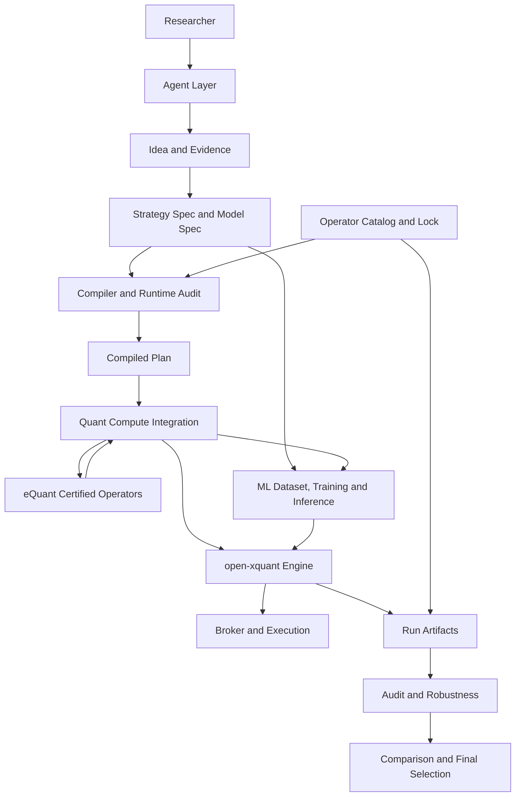

# open-xquant 与 eQuant-Py 整合架构设计

> 状态：方案 B 已由用户确认
>
> 前提：eQuant-Py 已完整满足
> [Quant Operator Contract v1](../../contracts/quant-operators/operator-contract-v1.md)。
>
> 目标：在两个仓库继续独立演进的前提下，将 eQuant-Py 作为
> open-xquant 的官方量化计算层，同时保持 open-xquant 对研究语义、
> 因果执行、审计、机器学习和 Agent 工作流的控制权。


## 1. 结论

open-xquant 不应合并 eQuant-Py 仓库，也不应把 eQuant-Py 直接设置为
所有核心模块的硬依赖。

最终关系应是：

> open-xquant 是 AI 原生的实用量化研究系统；
> eQuant-Py 是其首个官方认证量化计算层。

open-xquant 负责：

- 研究假设和 Strategy Spec。
- 组件语义和参数来源。
- 因果性和执行时点。
- 组合、规则、订单、Broker 和成交。
- 数据、算子、模型和运行版本。
- 回测、审计、稳健性、比较和最终选择。
- ML 数据集切分、训练、推理和模型 artifact。
- Agent skill、角色、确认和工作区治理。

eQuant-Py 负责：

- 技术指标和数值原语。
- 经典因子和 Alpha101。
- 横截面预处理和中性化。
- 因子合成和筛选算法。
- A 股日历、代码和数据工具。
- 可选的金融图表和形态识别。
- 计算性能和数值正确性。

eBacktestCraft 保持独立，但不成为 open-xquant 的正式执行引擎。

## 2. 为什么不采用 PR #61 的实现方式

本方案基于以下源码状态完成审阅：

- open-xquant `main`：`6af7fa7`。
- PR #61：`e5a9705`。
- eQuant-Py `master`：`6d91171`。

审阅覆盖 open-xquant 的 Engine、组件 Protocol、registry、component
manifest、Strategy Spec、compiler、factor evaluation、audit、robustness、
report 和 Agent 工作流，也覆盖 eQuant-Py 的 eTTR、eClassic、
eFactorCraft、eAlpha101、eBacktestCraft、edatatools 和统一入口。

PR #61 的方向有价值：它识别出了两个项目之间的能力互补。

但实现方式不能直接合并，原因包括：

- 将当前无法解析的 eQuant 子包加入核心硬依赖。
- PyPI 上的 `eQuant` 名称与目标项目不一致。
- 直接重写 26 个指标，却没有提交对应回归测试。
- 每个 symbol 单独执行 `to_panel -> eQuant -> from_panel`。
- 没有把 time-series、cross-section、panel 和 research-only 区分开。
- 允许通过字符串动态导入大量 eQuant 函数。
- 将标签生成、IC、PCA 和因子筛选作为普通便利函数暴露。
- 没有 fit/transform 边界，存在全样本拟合风险。
- 数据下载逻辑同时负责网络、缓存、时区和 provider 协议。
- 新增了 eBacktestCraft 依赖，但 open-xquant 并未使用它。
- 用 Python 3.9 兼容修改污染 Python 3.12 项目，且与集成目标无关。
- 文档鼓励 Agent 直接调用 eQuant，绕过 Strategy Spec 和审计路径。

因此，下一次 PR 不应在原 PR 上继续堆补丁。

应当基于新的跨仓库契约重新组织提交。

## 3. 框架定位

### 3.1 不是通用量化框架

open-xquant 不追求：

- 任意工作流 DAG。
- 任意代码插件。
- 任意数据模型。
- 任意回测引擎切换。
- 通过增加组件数量证明框架价值。

### 3.2 实用性的定义

open-xquant 的实用性应通过以下结果衡量：

- 更快提出可证伪的研究假设。
- 更早发现数据泄漏和伪相关。
- 更准确模拟成本、滑点、停牌和交易限制。
- 更系统地进行 OOS、稳健性和参数敏感性验证。
- 更低成本地积累可复用因子、模型和研究结论。
- 更可靠地把通过验证的策略迁移到 paper/live。
- 最终提高发现和保存可持续净收益策略的概率。

### 3.3 全面拥抱 AI

“全面拥抱 AI”包含两个不同方向：

- Agent：负责理解意图、生成候选、审阅证据和组织研究过程。
- Machine Learning：负责从特征和标签中学习可泛化预测关系。

两者必须被确定性研究内核约束。

Agent 不能直接改变正式运行语义。

模型不能绕过训练边界、数据版本和推理时点。

## 4. 目标架构



目标架构分为六个职责层。

### 4.1 Agent 层

负责：

- 收集研究想法。
- 追问假设和约束。
- 查询组件和算子 catalog。
- 构建候选 Strategy Spec 和 Model Spec。
- 解释审计、图表和实验差异。
- 在用户确认后推动阶段流转。

Agent 不负责：

- 直接计算正式指标。
- 直接修改回测结果。
- 绕过编译器调用任意 eQuant 函数。
- 推断用户没有确认的执行假设。

### 4.2 研究治理层

沿用 open-xquant 已有能力：

- strategy family、version 和 run attempt。
- idea brief 和 idea audit。
- spec audit 和 runtime audit。
- artifact lineage 和不可变证据。
- experiment comparison 和 final selection。

整合 eQuant 后，治理对象新增：

- operator catalog hash。
- operator lock。
- operator execution report。
- fitted operator state。
- model artifact 和 feature lineage。

### 4.3 编译层

编译器继续负责将声明式语义转换成可执行计划。

新增职责：

- 将 open-xquant 组件映射到认证 operator binding。
- 验证 execution scope。
- 验证 causality。
- 验证 output availability。
- 验证 required columns 和 warmup。
- 固定 operator contract、package version 和 digest。
- 区分 stateless、fit_transform 和 research_only。

### 4.4 官方量化计算层

这是 open-xquant 新增的内部集成边界。

它不等于“任意插件系统”。

它只执行通过认证的 operator binding。

负责：

- QuantPanel 转换。
- operator manifest 校验。
- 批量执行。
- 输出对齐。
- 诊断标准化。
- 实现 provenance 记录。
- 可选依赖隔离。

### 4.5 Engine 和交易执行层

继续由 open-xquant 拥有：

- Universe。
- PortfolioOptimizer。
- ExposurePolicy 和 Rule。
- Order generation。
- Fee、tax 和 slippage。
- Broker lifecycle。
- Fill 和 Position。
- paper/live 一致性。

eQuant-Py 不参与订单和成交语义。

### 4.6 ML 研究层

这是未来 open-xquant 的一等能力，不应交给 eQuant-Py 的便利函数隐式完成。

负责：

- FeatureSet。
- LabelSpec。
- PIT 数据切片。
- Purged time-series CV。
- Embargo。
- Walk-forward training。
- Estimator 配置。
- 随机种子和超参数。
- FittedModel artifact。
- 推理时点和特征可用性。
- 模型漂移和稳定性分析。

eQuant-Py 为 ML 层提供认证特征算子和拟合型变换。

## 5. 数据模型

### 5.1 保留 open-xquant 运行时宽表

当前 Engine 使用：

```python
dict[str, pd.DataFrame]
```

每个 symbol 对应一个带时区索引的宽表。

该模型与逐 bar 组合、规则和 Broker 逻辑结合紧密，
不应为了 eQuant-Py 全面改写 Engine。

### 5.2 集成边界使用 QuantPanel

在 operator executor 内部，将运行时宽表转换为 QuantPanel：

```text
dict[symbol, DataFrame]
        |
        v
QuantPanelAdapter.to_panel()
        |
        v
date, code, OHLCV, factor_1, factor_2
```

算子结果再按主键拆回：

```text
OperatorResult
        |
        v
QuantPanelAdapter.to_symbol_frames()
        |
        v
dict[symbol, Series or DataFrame]
```

### 5.3 不使用 PR #61 的时区处理

不能简单执行：

```python
index.tz_localize(None)
```

转换必须显式携带：

- timezone。
- calendar。
- timestamp semantics。
- frequency。

对日线 session date，可以使用无时区日期列，
但转换结果必须携带原始时区和日历上下文。

### 5.4 数据转换不属于指标类

指标实现不应重复调用 `to_panel()` 和 `from_panel()`。

转换应由 executor 对一个计算批次只执行一次。

## 6. open-xquant 新增核心类型

建议新增：

```text
src/oxq/operators/
  __init__.py
  types.py
  manifest.py
  catalog.py
  binding.py
  executor.py
  panel.py
  errors.py
```

### 6.1 `types.py`

定义：

```python
OperatorScope
OperatorLifecycle
OperatorCausality
OperatorAvailability
OperatorRequest
OperatorResult
OperatorDiagnostics
FittedOperatorState
```

这些是 open-xquant 自己的稳定类型，
不从 eQuant-Py 导入类型。

### 6.2 `manifest.py`

负责：

- 读取 OperatorManifest。
- JSON Schema 校验。
- 闭合字段校验。
- digest 校验。
- contract version 校验。

### 6.3 `catalog.py`

负责：

- 合并内置组件语义和外部算子元数据。
- 提供 Agent 可查询目录。
- 提供 compiler 精确查询。
- 输出稳定 catalog hash。

### 6.4 `binding.py`

定义组件语义与实现之间的绑定：

```yaml
component_name: SMA
component_kind: Indicator
operator_id: equant.ettr.sma
contract_version: 1
operator_version: 1.0.0
certification: runtime-certified
```

Strategy Spec 继续使用 `SMA`，不写 eQuant 模块名。

### 6.5 `executor.py`

定义 open-xquant 内部执行接口：

```python
class QuantOperatorExecutor(Protocol):
    def execute(self, request: OperatorRequest) -> OperatorResult: ...
```

正式 executor 只能执行已绑定、已锁定的算子。

### 6.6 `panel.py`

负责：

- 宽表与 QuantPanel 转换。
- 主键唯一性。
- 时区和日历上下文。
- 输入排序。
- 输出对齐。
- 行数和 symbol 完整性检查。

## 7. eQuant 官方集成包

建议在 open-xquant 仓库中新增：

```text
src/oxq/integrations/equant/
  __init__.py
  executor.py
  loader.py
  bindings.py
  package_probe.py
  diagnostics.py
```

### 7.1 `loader.py`

只加载 eQuant-Py 发布的：

- compatibility manifest。
- operator catalog。
- package metadata。

禁止接受任意 `pkg::function` 字符串。

### 7.2 `bindings.py`

只声明 open-xquant 已认证的绑定。

未认证 eQuant 函数不会自动出现在正式 registry 中。

### 7.3 `executor.py`

负责调用 eQuant-Py 的兼容入口，而不是直接调用全部公开函数。

它必须：

- 验证 package version。
- 验证 manifest digest。
- 验证 request 与 operator schema。
- 执行批量面板计算。
- 转换结构化错误。
- 生成 provenance。

### 7.4 `package_probe.py`

负责检查：

- distribution 是否安装。
- 版本是否在认证范围内。
- 可选原生依赖是否存在。
- catalog digest 是否匹配。

不允许静默降级到其他实现。

## 8. 组件 Protocol 的演进

### 8.1 保留现有 Protocol

现有 `Indicator`、`Signal`、`PortfolioOptimizer` 和 `Rule`
继续保留，避免破坏 SDK 和 workspace-local components。

### 8.2 新增批量计算能力

建议新增结构协议：

```python
class PanelComputable(Protocol):
    def compute_panel(
        self,
        mktdata: dict[str, pd.DataFrame],
        **params: object,
    ) -> dict[str, pd.Series | pd.DataFrame]: ...
```

Engine 的指标阶段按以下顺序执行：

1. `compute_panel()`。
2. 现有 `compute_cross_section()`。
3. 现有逐 symbol `compute()`。

这是一种有边界的执行扩展，不是任意 workflow 编排。

### 8.3 显式作用域

每个组件 catalog 项新增：

- `execution_scope`
- `causality`
- `availability`
- `operator_binding`

compiler 和 runtime audit 必须验证它们。

## 9. Engine 修改

当前 `Engine.setup()` 中指标阶段直接遍历组件并逐 symbol 调用。

目标修改：

```text
Collect indicator requirements
        |
        v
Resolve dependencies and operator bindings
        |
        v
Group by execution scope and executor
        |
        v
Convert each batch to QuantPanel once
        |
        v
Execute certified operators
        |
        v
Validate and attach outputs
```

Engine 仍然保持固定阶段：

```text
Universe
-> Indicator or Feature
-> Signal or Model Inference
-> Portfolio
-> Pre-trade Policy and Rule
-> Order Generation
-> Broker
-> Post-trade Rule
```

不允许算子插入任意新阶段或修改 Engine 内部状态。

## 10. 动态持仓上限和工作流扩展

此前工程师提出“每天由外挂流程计算持仓上限”。

在目标架构中，这不应做成任意 workflow node。

应新增受约束的一等概念：

```python
class ExposurePolicy(Protocol):
    def evaluate(
        self,
        date: pd.Timestamp,
        market_state: MarketState,
        portfolio: Portfolio,
        proposed_weights: dict[str, float],
    ) -> ExposureDecision: ...
```

它可以输出：

- 最大总仓位。
- 最大持仓数。
- 单标的上限。
- 行业或风险因子上限。
- 现金保留下限。
- 是否冻结调仓。

动态持仓上限策略必须：

- 在 Strategy Spec 中声明。
- 进入 compiled plan。
- 进入 runtime audit。
- 记录每日决策和原因。
- 作为实验维度参与比较。

这解决可扩展性问题，同时不牺牲治理。

## 11. Strategy Spec 演进

### 11.1 不暴露 eQuant 函数名

用户 Spec 继续声明语义组件：

```yaml
signal:
  indicators:
    momentum_20:
      type: Momentum
      params:
        period: 20
```

不允许：

```yaml
callable: ettr::momentum
```

### 11.2 新增 policy 声明

建议在 portfolio 下增加：

```yaml
portfolio:
  type: TopNRanking
  params: {}
  policies:
    exposure:
      type: RegimeExposure
      params:
        bull_max_exposure: 1.0
        bear_max_exposure: 0.3
```

### 11.3 算子实现不属于策略语义

operator binding 由认证 profile 和环境锁决定，
不要求普通用户写进 Strategy Spec。

但是 compiled plan 和 run artifacts 必须完整记录绑定。

### 11.4 显式 profile

研究工作区通过 `.open-xquant/workspace.yaml` 选择认证 profile：

```yaml
runtime:
  operator_profile: equant-certified-2026-07
```

profile 是运行环境配置，不是交易策略逻辑。

## 12. compiled plan 修改

`compiled_plan.json` 新增：

```yaml
operator_profile: equant-certified-2026-07
operator_bindings:
  momentum_20:
    component_name: Momentum
    operator_id: equant.eclassic.momentum
    contract_version: 1
    operator_version: 1.0.0
    distribution: equant-classic
    distribution_version: 1.0.0
    manifest_digest: sha256:aaaaaaaaaaaaaaaaaaaaaaaaaaaaaaaaaaaaaaaaaaaaaaaaaaaaaaaaaaaaaaaa
    implementation_digest: sha256:bbbbbbbbbbbbbbbbbbbbbbbbbbbbbbbbbbbbbbbbbbbbbbbbbbbbbbbbbbbbbbbb
    execution_scope: time_series
    lifecycle: stateless
    causality: past_only
    availability: close_t
    warmup_bars: 20
```

runtime audit 必须检查：

- Spec 组件与 binding 一致。
- binding 已认证。
- 版本范围合法。
- 运行环境实际安装版本匹配。
- causality 和 availability 与执行时点兼容。
- research-only 算子未进入 signal path。

## 13. 新增运行产物

每个正式 run 新增：

```text
operator_catalog.json
operator_lock.json
operator_execution_report.json
operator_diagnostics.json
```

### 13.1 `operator_lock.json`

记录本次 run 使用的全部：

- operator id。
- package version。
- contract version。
- manifest digest。
- implementation digest。
- optional dependency version。

### 13.2 `operator_execution_report.json`

记录每个算子：

- 输入行数。
- 输出行数。
- symbols 数量。
- warmup 行数。
- NaN 数量。
- 执行耗时。
- 峰值内存，可选。
- warnings。

### 13.3 fitted state

拟合型算子和 ML 模型额外归档：

```text
fitted_operators/
  momentum_pca_v1/
    state.bin
    state_manifest.json
```

## 14. 因子研究整合

### 14.1 保留 open-xquant FactorBundle

`FactorBundle` 继续作为 open-xquant 的研究对象，因为它已经承载：

- 对齐报告。
- limit day。
- suspension day。
- market state。
- asset metadata。

不应被 eFactorCraft 的裸 DataFrame 全面替换。

### 14.2 eFactorCraft 的角色

eFactorCraft 提供认证算法实现：

- winsorize。
- standardize。
- neutralize。
- factor synthesis。
- factor screening。
- regime calculation。

open-xquant 负责：

- 将 FactorBundle 转成 QuantPanel。
- 训练和评价时间边界。
- forward return 语义。
- PIT 和 T+1 偏移。
- 因子偏差审计。
- 结果 artifact 和报告。

### 14.3 不保留通用便利 wrapper

不建议保留 PR #61 中大而全的：

```text
src/oxq/factor_eval/equant.py
```

因子能力应通过 operator catalog 和 executor 进入统一路径。

## 15. Alpha101 整合

eAlpha101 应作为重要的新能力接入，但必须分批认证。

每个 Alpha 必须声明：

- required columns。
- execution scope。
- cross-sectional requirement。
- minimum history。
- output availability。
- neutralization assumption。
- numerical baseline。

不能因为目录中存在 101 个函数就一次性声明全部可用。

建议按以下顺序认证：

1. 只依赖 OHLCV、作用域清晰的 Alpha。
2. 需要横截面 rank 的 Alpha。
3. 需要相关性和复杂滚动原语的 Alpha。
4. 需要行业或其他外部数据的 Alpha。

## 16. 数据和日历整合

### 16.1 数据 provider

不接受 PR #61 中将下载、缓存和 MarketDataProvider 混在一个类中的设计。

目标拆分为：

```text
eQuant data connector
        |
        v
open-xquant downloader adapter
        |
        v
open-xquant data normalization
        |
        v
open-xquant parquet and manifest
        |
        v
LocalMarketDataProvider
```

open-xquant 继续拥有：

- 缓存目录。
- parquet 格式。
- 数据 manifest。
- hash。
- currency 和 timezone attrs。
- 数据完整性校验。

### 16.2 日历

edatatools 可以提供原始日历数据和日期算法。

open-xquant 继续拥有运行时 calendar 语义和 Broker 映射。

不新增平行的：

```text
market_calendar_equant.py
```

应实现已有 calendar/provider 边界的适配器。

## 17. eBacktestCraft 的边界

eBacktestCraft 不进入 open-xquant 正式依赖。

理由：

- 两个引擎的订单和成交语义不同。
- eBacktestCraft 直接消费目标权重列。
- 它没有 open-xquant 的完整 Spec、audit 和 artifact 治理。
- 同日权重和开盘执行的因果关系没有统一声明。
- 双引擎会让 Agent 不知道哪个结果是正式证据。

允许用途：

- eQuant-Py 独立用户快速验证。
- 算法开发者做 smoke backtest。
- open-xquant 内部交叉验证某些纯组合结果。

但交叉验证输出不能进入 final selection 的正式候选集。

## 18. eFinCharts 和 K 线形态

### 18.1 eFinCharts

可以作为可选 chart provider 接入报告资产层。

必须继续经过 open-xquant 的：

- chart asset manifest。
- source script hash。
- report QA。
- chart narrative review。

### 18.2 eCandleSticks

作为可选信号或特征算子接入。

TA-Lib 必须保持 optional dependency isolation。

缺失 TA-Lib 时不能影响核心包导入和非形态策略。

## 19. 机器学习目标架构

建议未来新增：

```text
src/oxq/ml/
  __init__.py
  schema.py
  features.py
  labels.py
  dataset.py
  split.py
  pipeline.py
  trainer.py
  inference.py
  artifacts.py
  registry.py
```

### 19.1 Model Spec

Strategy Spec 可选增加：

```yaml
model:
  enabled: true
  features:
    - momentum_20
    - rsi_14
    - alpha_006
  label:
    type: ForwardReturn
    horizon: 5
  estimator:
    type: LightGBMRanker
    params: {}
  validation:
    type: PurgedWalkForward
    train_window: 756
    test_window: 63
    embargo: 5
  inference:
    availability: close_t
```

### 19.2 eQuant 的 ML 角色

eQuant 提供：

- 特征算子。
- 标签算子。
- 拟合型预处理算子。
- 因子合成状态。

open-xquant 提供：

- 数据集版本。
- 时间切分。
- 泄漏防护。
- estimator registry。
- 模型训练和推理。
- model artifact。
- OOS 和 robustness。

### 19.3 模型 artifact

每个模型必须归档：

- Model Spec。
- FeatureSet hash。
- LabelSpec hash。
- train/test 日期。
- split manifest。
- estimator package 和版本。
- random seed。
- fitted model digest。
- feature importance。
- OOS predictions。
- calibration 和 stability evidence。

## 20. Agent 层修改

Agent 不直接阅读所有 eQuant 函数文档。

新增或修改以下行为：

- component catalog 查询 operator metadata。
- builder 只使用已认证 semantic component。
- audit 检查 causality 和 availability。
- runtime auditor 检查 operator lock。
- runner 只执行授权后的 compiled plan。
- monitor 检查算子和模型版本漂移。
- report writer 引用 operator 和 model provenance。

新增 Agent skill 的优先级应低于核心确定性能力。

先有稳定 CLI 和 artifacts，再增加 Agent 编排。

## 21. 现有代码的修改清单

### 21.1 新增目录

```text
contracts/quant-operators/
src/oxq/operators/
src/oxq/integrations/equant/
tests/operators/
tests/integrations/equant/
```

未来 ML 阶段新增：

```text
src/oxq/ml/
tests/ml/
```

### 21.2 修改 `src/oxq/core/types.py`

修改原则：

- 保留现有四类组件 Protocol。
- 新增或从独立模块导出 `PanelComputable`。
- 不向核心类型暴露 eQuant 类型。

### 21.3 修改 `src/oxq/core/registry.py`

新增：

- operator metadata 绑定。
- certification level。
- execution scope。
- causality 和 availability。

保留 workspace-local component 注册机制。

外部算子实现不直接覆盖 registry 项，
而是通过认证 binding 连接现有 semantic component。

### 21.4 修改 `src/oxq/core/component_catalog.py`

catalog 输出新增：

- operator binding。
- contract version。
- certification。
- ML metadata。
- source package 和版本范围。

### 21.5 修改 `src/oxq/core/engine.py`

仅修改指标或特征计算阶段：

- 支持 `compute_panel()`。
- 批量调用 executor。
- 输出对齐和诊断。
- tracer 记录 operator provenance。

不重写逐 bar 交易阶段。

### 21.6 修改 `src/oxq/spec/schema.py`

近期只增加：

- portfolio policies。

operator profile 固定放在 `.open-xquant/workspace.yaml`，不进入
Strategy Spec schema。

ML section 在单独版本中加入，避免一次性扩大 PR。

### 21.7 修改 `src/oxq/spec/compiler.py`

新增：

- binding resolution。
- scope 和 causality 校验。
- operator bindings 输出。
- operator lock 输入。
- warmup 汇总。

### 21.8 修改 `src/oxq/spec/validator.py`

新增：

- 未认证 operator fatal。
- research-only 进入 signal path fatal。
- availability 与 execution 冲突 fatal。
- 缺失 required columns fatal。
- fit_transform 缺失训练边界 fatal。

### 21.9 修改审计模块

`src/oxq/audit/reproducibility.py` 新增：

- operator lock hash。
- package version。
- manifest 和 implementation digest。
- fitted state digest。

`src/oxq/audit/research_bias.py` 新增：

- causality 分类检查。
- label-dependent 路径检查。
- fitted state 训练截止时间检查。

### 21.10 修改 run digest 和 report QA

将新 operator artifacts 纳入：

- artifact hashes。
- run digest。
- report facts。
- report QA。

### 21.11 修改 `pyproject.toml`

核心 dependencies 不加入任何 eQuant 包。

增加可选 extra：

```toml
[project.optional-dependencies]
equant = [
  "equant-core>=1.2,<1.3",
  "equant-ttr>=1.2,<1.3",
  "equant-classic>=1.2,<1.3",
  "equant-alpha101>=1.2,<1.3",
  "equant-factorcraft>=1.2,<1.3",
  "equant-datatools>=1.2,<1.3",
]
```

这里的 `1.2` 是兼容发布线示例，不是对未来真实版本号的预设。

正式版本不使用范围宽松的 `>=0.1.0`。

认证 profile 和 lock 决定精确版本。

## 22. 应删除或拒绝的 PR #61 内容

如果下一次 PR 基于 PR #61 继续开发，应删除或重写以下内容。

### 22.1 删除当前通用动态适配器

删除：

```text
src/oxq/adapters/equant.py
```

原因：

- 任意字符串导入。
- scope 不明确。
- 因果性不明确。
- 时区转换不安全。
- `_is_equant_indicator` 判断无实际认证价值。

由 `src/oxq/integrations/equant/` 的认证 executor 替代。

### 22.2 删除当前数据 provider

删除或彻底重写：

```text
src/oxq/data/equant_provider.py
```

原因：

- 网络下载与缓存职责混合。
- 缓存没有接入现有数据 manifest。
- 时区持久化和恢复逻辑不完整。
- 单 symbol 下载不能表达部分失败的完整性。

### 22.3 删除当前 factor convenience wrapper

删除：

```text
src/oxq/factor_eval/equant.py
```

由统一 operator executor、FactorBundle adapter 和研究 artifacts 替代。

### 22.4 删除平行 calendar API

删除：

```text
src/oxq/market_calendar_equant.py
```

通过已有 calendar/provider 边界适配 edatatools。

### 22.5 撤回直接指标替换

PR 不应直接重写现有指标并改变数值语义。

下一次 PR 初期应新增 shadow implementation 和 parity tests。

认证通过后再按独立提交迁移具体组件。

### 22.6 删除核心硬依赖

删除以下核心 dependencies：

```text
eTTR
eClassic
eFactorCraft
eBacktestCraft
edatatools
equant
```

仅在 optional extra 中加入已正式发布和认证的包。

### 22.7 不合并无关兼容修改

不接受为了 eQuant 集成而修改：

- `datetime.UTC`。
- Python 3.9 entry point 兼容。

open-xquant 的运行基线仍为 Python 3.12。

若这些修改本身有价值，应单独 PR。

### 22.8 重写 Agent 文档

删除“Agent 可以直接调用全部 eQuant 函数”的正式工作流建议。

正确路径是：

```text
Agent -> Catalog -> Spec -> Compile -> Certified Executor
```

## 23. 现有原生指标的删减策略

不能一次删除所有重复实现。

采用以下迁移状态：

```text
native-only
shadow-equant
equant-default
native-removed
```

### 23.1 `native-only`

原生实现继续作为正式实现。

### 23.2 `shadow-equant`

同一 fixture 同时运行原生和 eQuant 实现。

记录：

- 最大绝对误差。
- 最大相对误差。
- NaN 区域差异。
- warmup 差异。
- 策略级收益差异。
- 性能差异。

### 23.3 `equant-default`

只有满足以下条件才切换：

- operator runtime-certified。
- 数值差异被接受。
- 策略回归通过。
- 性能不退化。
- open-xquant 发布说明明确记录。

### 23.4 `native-removed`

原生实现删除前必须：

- 至少经过一个稳定发布周期。
- 历史运行仍能通过 archived lock 解释。
- 没有 workspace-local code 依赖原生私有函数。

对于有意改变数学公式的算子，不能称为 parity migration。

必须作为新的组件语义或 major behavior change 处理。

## 24. 下一次 PR 的合理范围

不建议再次提交一个覆盖 28 个文件、同时修改依赖、指标、数据、因子和日历的
大 PR。

建议拆成以下 PR 序列。

### PR 1：契约和 manifest 基础

包含：

- JSON Schema。
- operator types。
- manifest validation。
- catalog ingestion。
- 纯单元测试。

不调用 eQuant。

### PR 2：eQuant optional integration

包含：

- package probe。
- certified loader。
- executor。
- QuantPanel adapter。
- 一个最小 fake provider 测试。

### PR 3：首批时间序列指标

只接入：

- SMA。
- EMA。
- RSI。
- ATR。
- Momentum。

要求 shadow parity 和 performance tests。

### PR 4：横截面和面板算子

接入：

- RPS。
- 标准化。
- 去极值。
- 一到两个作用域清晰的 Alpha101。

### PR 5：拟合型因子工程

接入：

- 中性化。
- PCA。
- IC/ICIR 加权。

必须同时实现 fitted state artifacts。

### PR 6：数据和日历适配

接入：

- downloader adapter。
- edatatools calendar source。
- 数据 manifest 和完整性测试。

### PR 7：Agent catalog 和文档

最后增加：

- Agent 查询能力。
- builder/auditor 规则。
- 用户指南。
- operator provenance 报告说明。

## 25. 测试策略

### 25.1 契约测试

覆盖：

- manifest schema。
- package/version probe。
- scope 和 causality。
- required columns。
- output alignment。
- structured errors。

### 25.2 数值测试

每个迁移算子覆盖：

- golden fixture。
- 原生与 eQuant parity。
- 单 symbol 与 panel batch parity。
- NaN 和 warmup。
- shuffled input。
- timezone round-trip。

### 25.3 策略回归

至少覆盖：

- SMA crossover。
- momentum rotation。
- RPS Top-N。
- A 股带交易限制策略。

比较：

- target weights。
- trades。
- equity curve。
- metrics。
- artifact hashes 的预期变化范围。

### 25.4 审计测试

必须证明：

- research-only 算子不能进入信号。
- operator lock 缺失会阻止正式运行。
- package version 不匹配会阻止运行。
- fitted state 训练日期穿越会阻止运行。
- 未认证函数不能通过动态字符串执行。

### 25.5 性能测试

建立：

- 100 symbols。
- 500 symbols。
- 5000 symbols。

批量执行必须显著优于逐 symbol 适配方式。

## 26. 失败策略

正式运行遵循 fail closed：

- manifest 不匹配：阻止编译或运行。
- package 未安装：明确报告所需 optional extra。
- 版本超出认证范围：阻止运行。
- 输出主键变化：阻止运行。
- 部分 symbol 失败：默认阻止运行。
- research-only 进入 signal：阻止编译。
- fitted state 缺失：阻止推理。
- operator profile 漂移：要求新 run，不复用旧授权。

不允许静默切换回原生实现。

如果用户要比较原生和 eQuant 实现，应创建明确的两个实验候选。

## 27. 可观测性

DefaultTracer 新增 operator 事件：

```text
operator_start
operator_complete
operator_warning
operator_failed
operator_fit
operator_transform
```

每个事件记录：

- semantic component。
- operator id。
- package version。
- scope。
- 输入输出规模。
- duration。
- diagnostics。

日志只用于观测，正式证据写入 artifacts。

## 28. 实验比较

算子实现可以成为实验维度：

```text
implementation = native
implementation = equant
```

动态持仓上限也可以成为实验维度：

```text
exposure_policy = static_100
exposure_policy = regime_100_30
exposure_policy = volatility_target_15
```

比较必须区分：

- 策略语义变化。
- 算子实现变化。
- 数据版本变化。
- 参数变化。
- 执行假设变化。

不能把这些差异混成一次无法解释的“新版本”。

## 29. 发布与兼容治理

### 29.1 eQuant-Py 发布

eQuant-Py 独立发布 release candidate 和正式版本。

### 29.2 open-xquant 认证

open-xquant 在自己的 CI 和认证记录中决定是否支持该版本。

### 29.3 异步升级

eQuant-Py 新版本发布后，open-xquant 不自动升级。

只有在：

- contract tests 通过。
- numerical tests 通过。
- strategy regressions 通过。
- performance tests 通过。
- compatibility matrix 更新。

之后才能进入新的 certified profile。

## 30. 路线图

### 阶段 0：跨仓库契约

完成：

- Quant Operator Contract。
- QuantPanel schema。
- OperatorManifest schema。
- eQuant package 和 CI 整改。

### 阶段 1：最小官方计算层

完成：

- operator types。
- catalog。
- lock。
- executor。
- QuantPanel adapter。
- 首批时间序列指标。

### 阶段 2：横截面和因子研究

完成：

- RPS。
- Alpha101 首批。
- preprocessing。
- FactorBundle adapter。
- 因子 artifact。

### 阶段 3：拟合型算子和 ML

完成：

- fitted state。
- Model Spec。
- purged walk-forward。
- model artifact。
- inference audit。

### 阶段 4：A 股实用能力

完成：

- PIT universe。
- ST、停牌和涨跌停。
- 日历和复权。
- A 股成本和 lot size。
- 组合暴露 policy。

### 阶段 5：paper/live 迁移

完成：

- 在线特征一致性。
- 模型和算子版本锁。
- data freshness。
- drift monitoring。
- research-to-live semantic audit。

## 31. 验收标准

整合方案完成不能只以“能够 import eQuant”判断。

必须同时满足：

- open-xquant 核心安装不依赖 eQuant。
- eQuant optional extra 可重复安装。
- 未认证函数无法进入正式执行。
- Strategy Spec 不包含 eQuant 实现细节。
- compiled plan 完整记录 operator binding。
- run artifacts 完整记录版本和摘要。
- Engine 面板批量执行。
- 时间序列、横截面和研究算子正确分流。
- 标签和未来数据无法进入交易信号。
- 拟合型算子拥有训练边界和 state artifact。
- 数值和策略回归通过。
- eBacktestCraft 不成为正式引擎。
- Agent 只能通过 catalog 和 Spec 使用算子。
- 动态策略约束通过正式 policy 建模。
- 两个仓库可以独立发布和独立升级。

## 32. 最终架构原则

这次整合不应被理解成“open-xquant 缺少指标，所以引入 eQuant-Py”。

它真正建立的是三个长期能力：

1. 可认证的量化算法资产供应链。
2. 面向 Agent 和机器学习的结构化计算语义。
3. 从研究到回测再到实盘的一致性和可追溯性。

eQuant-Py 提高 open-xquant 的计算广度和深度。

open-xquant 则把这些算法变成可以被严肃研究、验证、比较和交易的资产。
